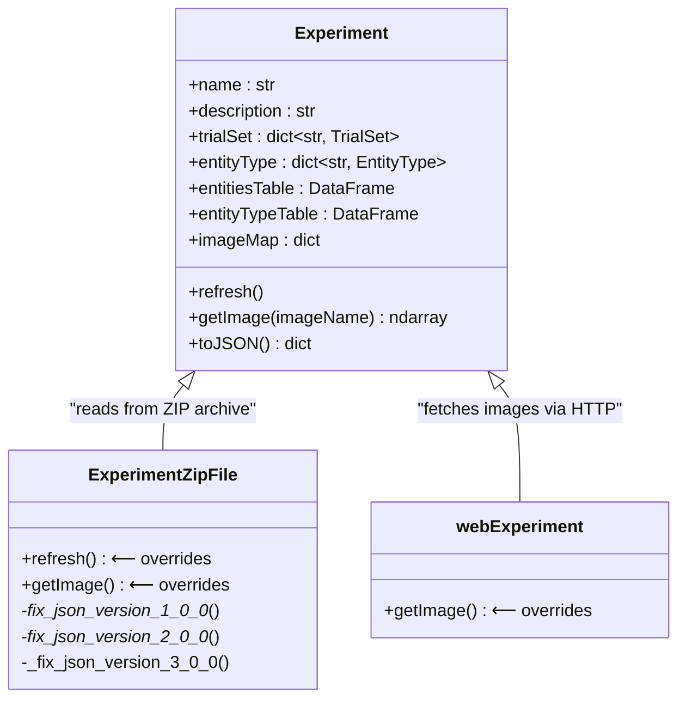
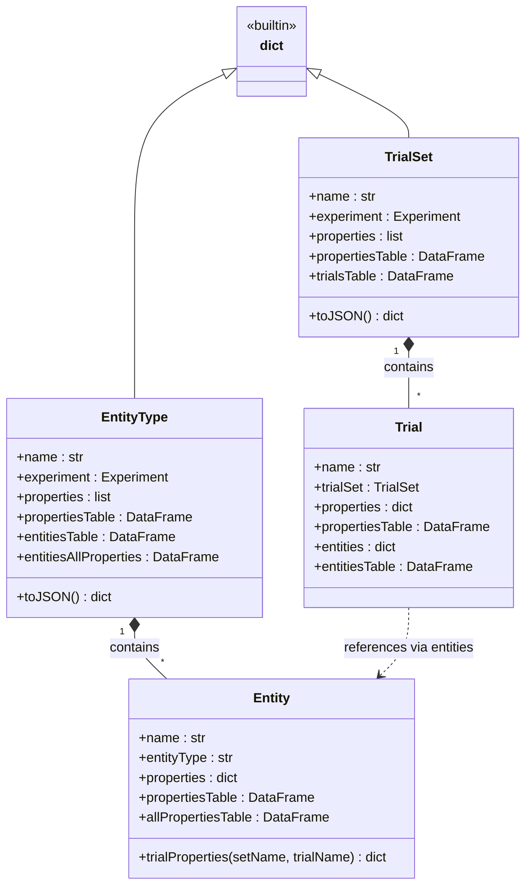
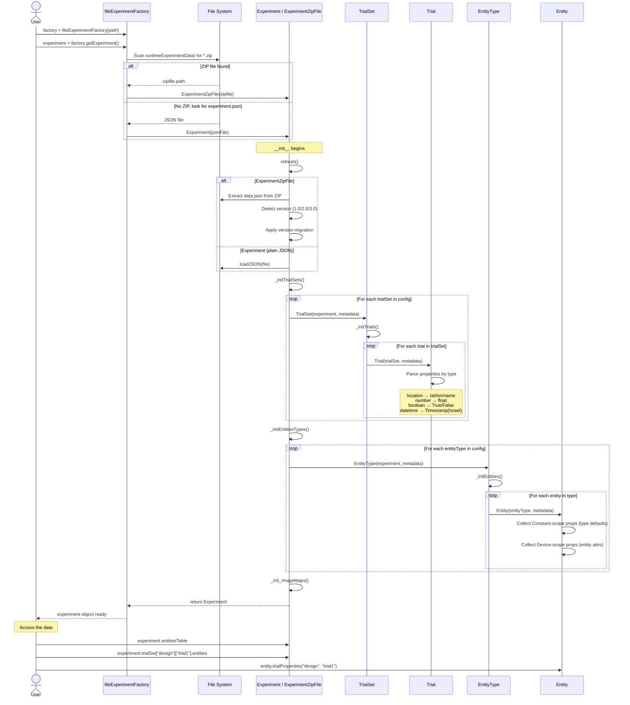
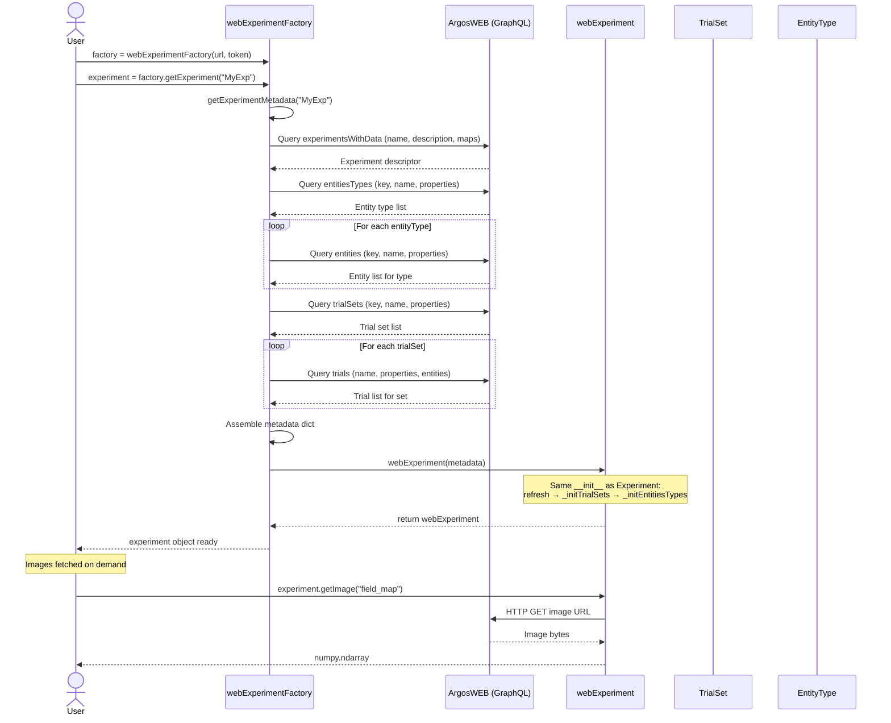
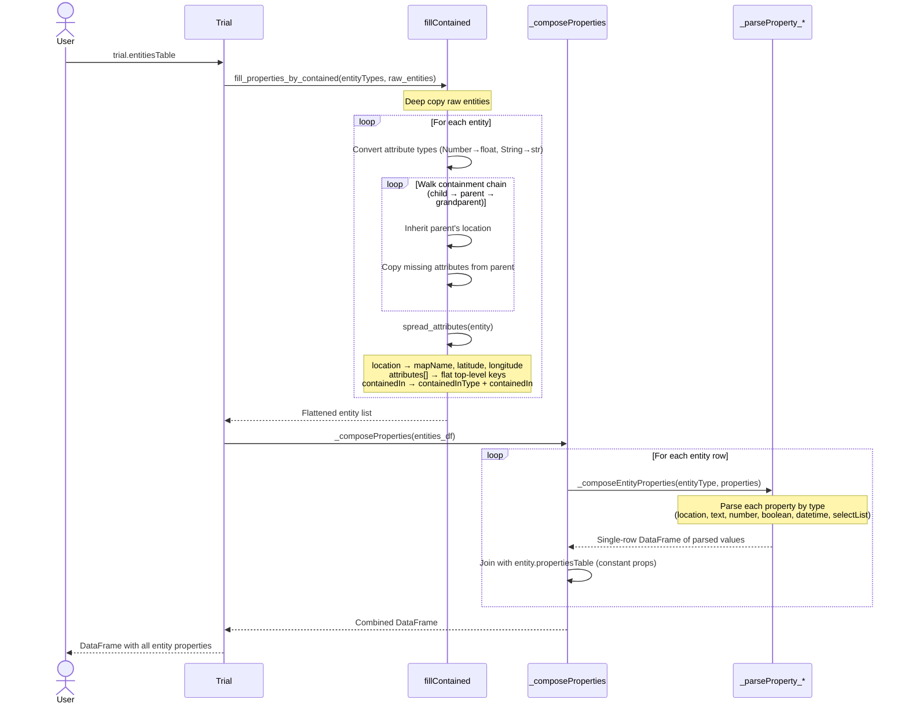

# Experiment Setup API

**Module:** `argos.experimentSetup`

The experiment setup module is the core of pyArgos. It provides the factory pattern for loading experiments from different sources and the data object hierarchy that represents experiments, trials, and entities.

---

## Class Roles at a Glance

Each class in this module has a distinct responsibility in the experiment lifecycle:

| Class | Role | Analogy |
|-------|------|---------|
| `fileExperimentFactory` | Locates and loads experiment data from local disk | File browser |
| `webExperimentFactory` | Fetches experiment data from ArgosWEB via GraphQL | API client |
| `Experiment` | Root container holding all entity types, trial sets, and image maps | Project folder |
| `ExperimentZipFile` | Variant of Experiment that reads from a `.zip` archive (with version migration) | ZIP reader |
| `webExperiment` | Variant of Experiment that fetches images over HTTP | Remote reader |
| `TrialSet` | Named collection of trials (e.g., "design", "deploy") | Folder of trials |
| `Trial` | A single experimental configuration with per-entity attributes | Configuration snapshot |
| `EntityType` | Schema definition + collection of entities of one type (e.g., "Sensor") | Device class |
| `Entity` | A single device/asset instance with constant and trial-specific properties | Individual device |

---

## Inheritance Diagram

### Experiment Hierarchy

`Experiment` is the base class. Two subclasses override only the data-loading and image-fetching behavior, keeping the rest of the interface identical:



**What each subclass changes:**

- **ExperimentZipFile** -- `refresh()` extracts `data.json` from the ZIP, detects the schema version, and applies the appropriate migration. `getImage()` reads images from inside the archive. `_init_ImageMaps()` parses the ZIP's internal map format.
- **webExperiment** -- `getImage()` does an HTTP GET to fetch the image from the ArgosWEB server. Everything else is inherited.

### Container Hierarchy (dict-based)

`TrialSet` and `EntityType` extend Python's built-in `dict`, so they work as both typed objects with properties **and** dictionaries for accessing children by name:



This means you can write:

```python
# Dict-style access to children
trial = experiment.trialSet["design"]["morning"]
entity = experiment.entityType["Sensor"]["Sensor_01"]

# But also use rich properties
experiment.trialSet["design"].trialsTable      # DataFrame of all trials
experiment.entityType["Sensor"].entitiesTable  # DataFrame of all sensors
```

---

## Call Workflow: Loading an Experiment from File

This swimlane diagram shows the complete call chain when a user loads an experiment from local files, from the initial factory call through object construction and the resulting object graph:



---

## Call Workflow: Loading an Experiment from Web



---

## Call Workflow: Accessing Trial Entity Data

When you access `trial.entities` or `trial.entitiesTable`, the containment hierarchy is resolved on-the-fly:



---

## Module Entry Point

::: argos.experimentSetup.getExperimentSetup
    options:
      show_root_heading: true
      heading_level: 3

---

## Factories

### fileExperimentFactory

**Role:** Scans the experiment directory for data files (ZIP or JSON) and returns the appropriate Experiment subclass. This is the primary entry point for loading experiments from local disk.

**Key behavior:**

- Looks in `<path>/runtimeExperimentData/` for `.zip` files first
- Falls back to `experiment.json` if no ZIP is found
- Returns `ExperimentZipFile` for ZIP sources, `Experiment` for JSON

::: argos.experimentSetup.dataObjectsFactory.fileExperimentFactory
    options:
      show_root_heading: true
      heading_level: 4
      members:
        - __init__
        - getExperiment

---

### webExperimentFactory

**Role:** Connects to an ArgosWEB server via GraphQL and fetches experiment data remotely. Supports listing experiments, fetching metadata, and loading complete experiments.

**Key behavior:**

- Authenticates with a token-based authorization header
- Issues multiple GraphQL queries to assemble the full experiment: entity types, entities, trial sets, trials
- Returns a `webExperiment` object whose `getImage()` fetches images over HTTP

::: argos.experimentSetup.dataObjectsFactory.webExperimentFactory
    options:
      show_root_heading: true
      heading_level: 4
      members:
        - __init__
        - getExperiment
        - getExperimentMetadata
        - getExperimentsDescriptionsList
        - getExperimentsDescriptionsTable
        - getExperimentDescriptor
        - listExperimentsNames
        - url
        - client
        - keys

---

## Data Objects

### Experiment

**Role:** The root container for all experiment data. Holds the entity type hierarchy (types → entities) and the trial set hierarchy (sets → trials). Exposes all data as Pandas DataFrames and provides image map access for spatial visualization.

**When to use:** You never instantiate this directly -- use a factory. But all your interactions with experiment data go through this class.

::: argos.experimentSetup.dataObjects.Experiment
    options:
      show_root_heading: true
      heading_level: 4
      members:
        - __init__
        - refresh
        - setup
        - name
        - description
        - url
        - client
        - trialSet
        - entityType
        - entityTypeTable
        - entitiesTable
        - trialsTableAllSets
        - trialsTable
        - imageMap
        - getImage
        - getImageURL
        - getImageMetadata
        - getImageJSMappingFunction
        - getExperimentEntities
        - getEntitiesTypeByID
        - toJSON

---

### ExperimentZipFile

**Role:** Handles experiments packaged as `.zip` archives (the standard export format from ArgosWEB). Overrides `refresh()` to extract and version-migrate `data.json` from the archive, and `getImage()` to read images from inside the ZIP.

**Version migrations:** Automatically normalizes JSON schema versions 1.0.0, 2.0.0, and 3.0.0 to a standard internal format. See the [Architecture page](../architecture/experiment_setup.md#version-migration-detail) for migration details.

::: argos.experimentSetup.dataObjects.ExperimentZipFile
    options:
      show_root_heading: true
      heading_level: 4
      members:
        - __init__
        - refresh
        - getImage

---

### webExperiment

**Role:** Handles experiments fetched from a remote ArgosWEB server. The only override is `getImage()`, which fetches images via HTTP GET instead of reading from disk.

::: argos.experimentSetup.dataObjects.webExperiment
    options:
      show_root_heading: true
      heading_level: 4
      members:
        - getImage

---

### TrialSet

**Role:** A named collection of trials (e.g., `"design"`, `"deploy"`). Extends `dict` so trials can be accessed by name: `trial_set["myTrial"]`. Defines the attribute type schema that all trials in the set share.

**Key concept:** The `attributeTypes` (accessed via `properties` / `propertiesTable`) define what properties each trial *can* have and their types. Individual trials then hold the actual values.

::: argos.experimentSetup.dataObjects.TrialSet
    options:
      show_root_heading: true
      heading_level: 4
      members:
        - __init__
        - experiment
        - name
        - description
        - numberOfTrials
        - properties
        - propertiesTable
        - trials
        - trialsTable
        - toJSON

---

### Trial

**Role:** A single experimental configuration that maps entities to their trial-specific attributes. This is where per-experiment variables live (sensor positions, thresholds, calibration values).

**Key concept:** When you access `trial.entities` or `trial.entitiesTable`, the containment hierarchy is resolved: child entities inherit properties from their parents, locations are spread into lat/lon, and all property types are parsed. See the [containment resolution workflow](#call-workflow-accessing-trial-entity-data) above.

**Property parsing:** Each property value is parsed according to its type (defined in the parent TrialSet's `attributeTypes`): `location` → lat/lon/name, `number` → float, `boolean` → True/False, `datetime_local` → Timestamp with Israel timezone, etc.

::: argos.experimentSetup.dataObjects.Trial
    options:
      show_root_heading: true
      heading_level: 4
      members:
        - __init__
        - experiment
        - trialSet
        - name
        - created
        - cloneFrom
        - numberOfEntities
        - properties
        - propertiesTable
        - entities
        - entitiesTable
        - toJSON

---

### EntityType

**Role:** Defines a category of devices or assets (e.g., `"Sensor"`, `"WeatherStation"`). Extends `dict` so entities can be accessed by name: `entity_type["Sensor_01"]`. Holds the attribute type schema (what properties entities of this type have) and the collection of entity instances.

**Key concept:** The `attributeTypes` include a `scope` field. Attributes with `scope="Constant"` become default values for all entities of this type. Other scopes are per-entity or per-trial.

::: argos.experimentSetup.dataObjects.EntityType
    options:
      show_root_heading: true
      heading_level: 4
      members:
        - __init__
        - experiment
        - name
        - numberOfEntities
        - properties
        - propertiesTable
        - entitiesTable
        - entitiesAllProperties
        - toJSON

---

### Entity

**Role:** A single device or asset instance. Has constant properties (from its type defaults + its own attributes) and trial-specific properties (set per trial). Provides multiple views of its data: flat dict, list of dicts with scope, DataFrame, and per-trial lookups.

**Property scopes:**

- **Constant** -- from EntityType `attributeTypes` where `scope="Constant"` (type-level defaults)
- **Device** -- from the entity's own `attributes` in the metadata (instance-level overrides)
- **Trial** -- from trial entity data (changes per trial)

Use `entity.properties` for constant+device, `entity.trialProperties(set, trial)` for trial-specific, and `entity.allPropertiesTable` for everything combined.

::: argos.experimentSetup.dataObjects.Entity
    options:
      show_root_heading: true
      heading_level: 4
      members:
        - __init__
        - name
        - entityType
        - experiment
        - properties
        - propertiesList
        - propertiesTable
        - allProperties
        - allPropertiesList
        - allPropertiesTable
        - allTrialProperties
        - allTrialPropertiesTable
        - trialProperties
        - toJSON

---

## Utility Functions

### Containment Resolution

**Role:** The `fillContained` module resolves parent-child entity relationships. When an entity is "contained in" another (e.g., a sensor on a pole at a location), it inherits the parent's properties (especially location). This is called automatically when you access `trial.entitiesTable`.

See the [containment resolution workflow](#call-workflow-accessing-trial-entity-data) above for the full call sequence.

::: argos.experimentSetup.fillContained.fill_properties_by_contained
    options:
      show_root_heading: true
      heading_level: 4

::: argos.experimentSetup.fillContained.spread_attributes
    options:
      show_root_heading: true
      heading_level: 4

::: argos.experimentSetup.fillContained.get_parent
    options:
      show_root_heading: true
      heading_level: 4

::: argos.experimentSetup.fillContained.key_from_name
    options:
      show_root_heading: true
      heading_level: 4
