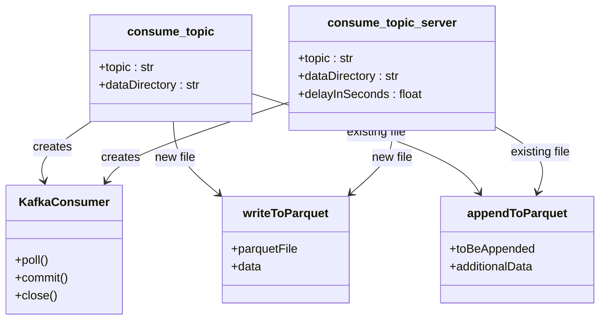
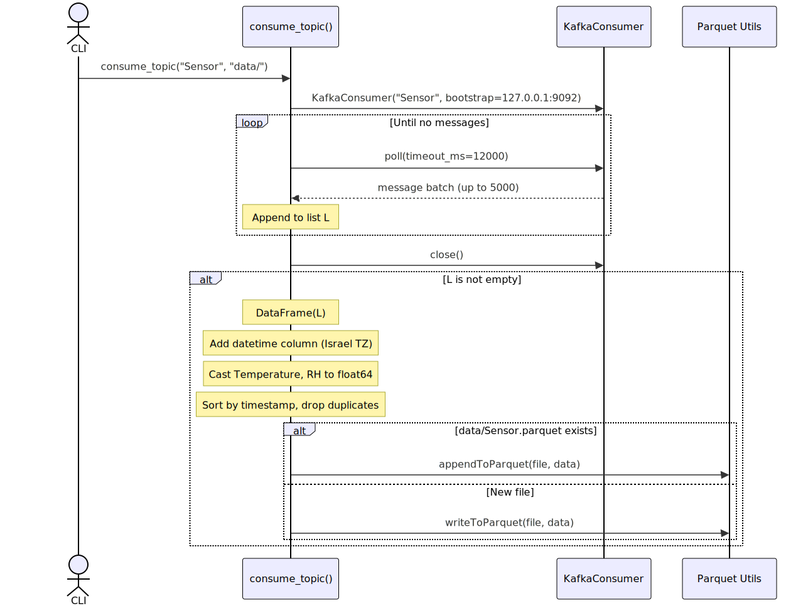
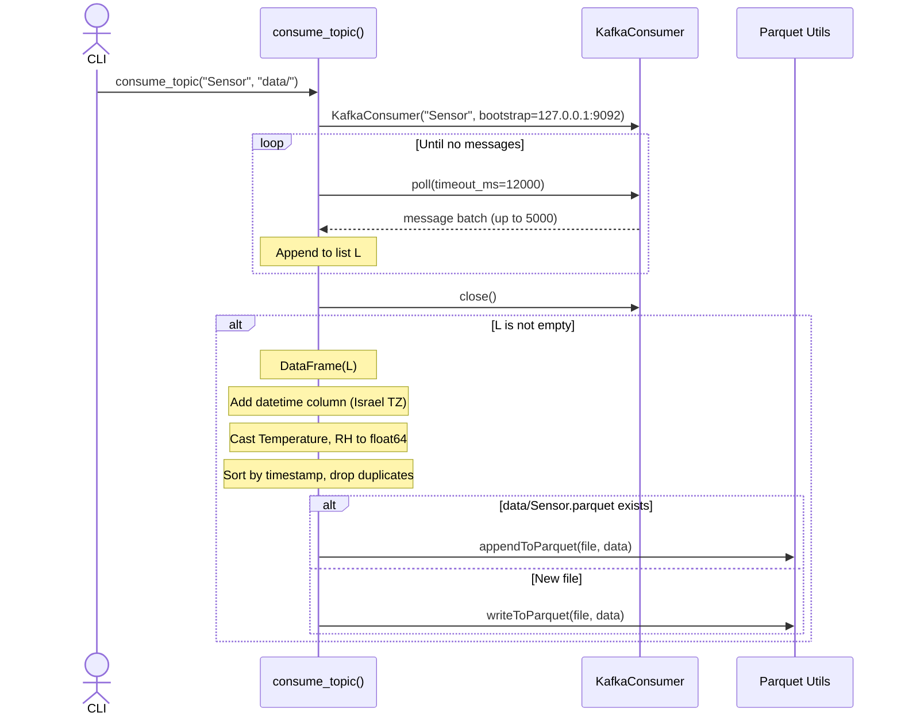
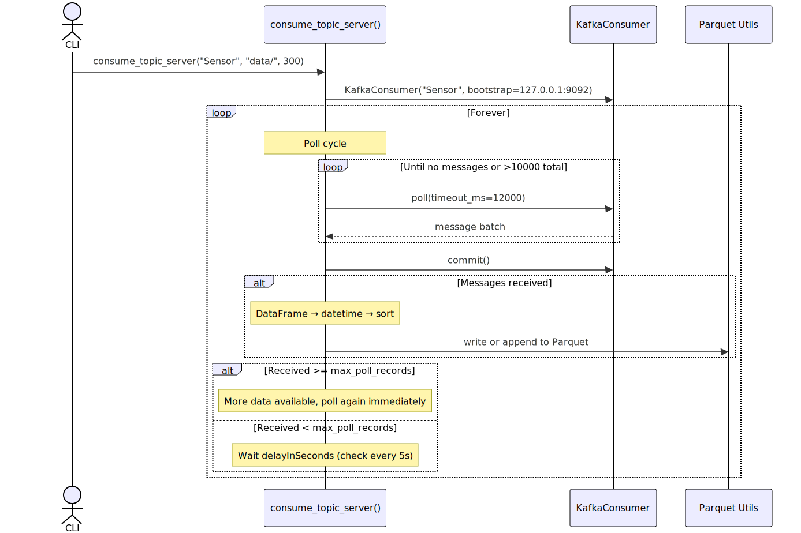
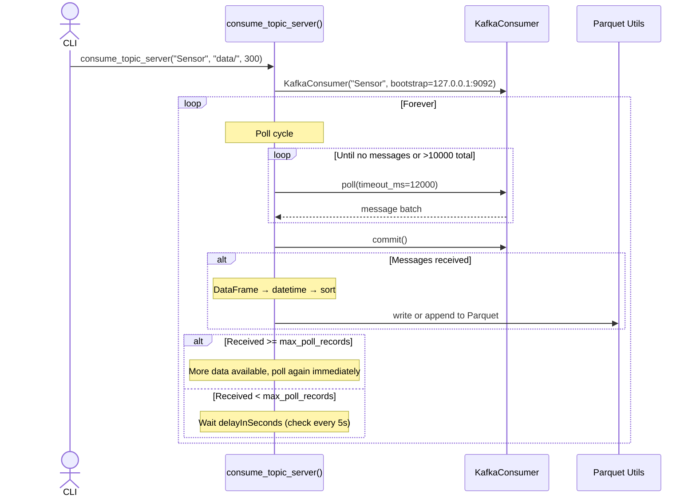

# Kafka Consumer API

**Module:** `argos.kafka.consumer`

The Kafka consumer module reads device telemetry from Kafka topics and persists it as Parquet files — the primary data ingestion path during experiment execution.

---

## Role in the System

```
Devices ──> Node-RED ──> Kafka ──> [this module] ──> Parquet files
                                   consume_topic()
                                   consume_topic_server()
```

Each device type gets its own Kafka topic (created by the CLI's `kafka_createTopics`). This module provides two consumer functions:

- `consume_topic` — one-shot: drain all available messages, write to Parquet, exit
- `consume_topic_server` — continuous: poll in an infinite loop with configurable delay

---

## Class Dependency



<!-- mermaid source (for editing, paste into mermaid.live):

-->

---

## Swimlane: One-Shot Consumption



<!-- mermaid source (for editing, paste into mermaid.live):

-->

## Swimlane: Server-Mode Consumption



<!-- mermaid source (for editing, paste into mermaid.live):

-->

---

## Implementation Notes

**Consumer configuration** (hardcoded):

| Setting | Value | Notes |
|---------|-------|-------|
| `bootstrap_servers` | `127.0.0.1:9092` | Single broker |
| `group_id` | `'1'` | All consumers share one group |
| `auto_offset_reset` | `'earliest'` | Start from beginning on first run |
| `max_poll_records` | `5000` | Batch size per poll |
| `value_deserializer` | JSON (ASCII) | Messages are JSON strings |

**Data transformations:**

1. JSON messages → Pandas DataFrame
2. `timestamp` (ms since epoch) → `datetime` column (Israel timezone)
3. `Temperature`, `RH` fields → `float64` (if present)
4. Sort by timestamp, drop duplicates (one-shot mode only)

**Known limitations:**

- Broker address and group ID are hardcoded
- Deduplication only works within a single consumer run, not across restarts
- No handling of out-of-order messages across partitions
- Server mode checks every 5 seconds during delay, but does not react to new messages during the wait

---

## Functions

### consume_topic

::: argos.kafka.consumer.consume_topic
    options:
      show_root_heading: true
      heading_level: 4

---

### consume_topic_server

::: argos.kafka.consumer.consume_topic_server
    options:
      show_root_heading: true
      heading_level: 4
