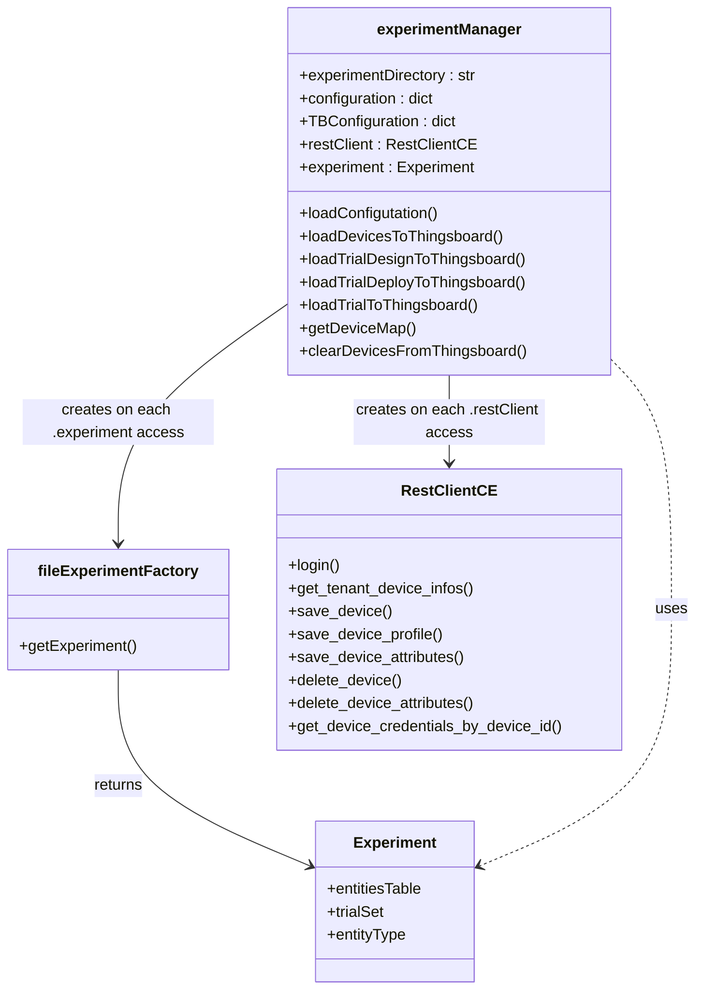
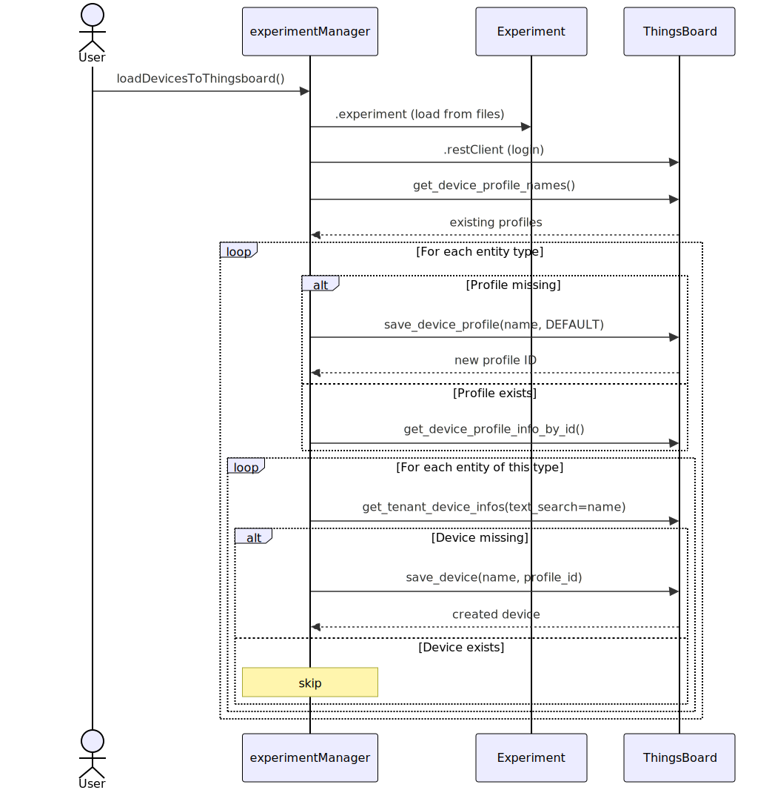
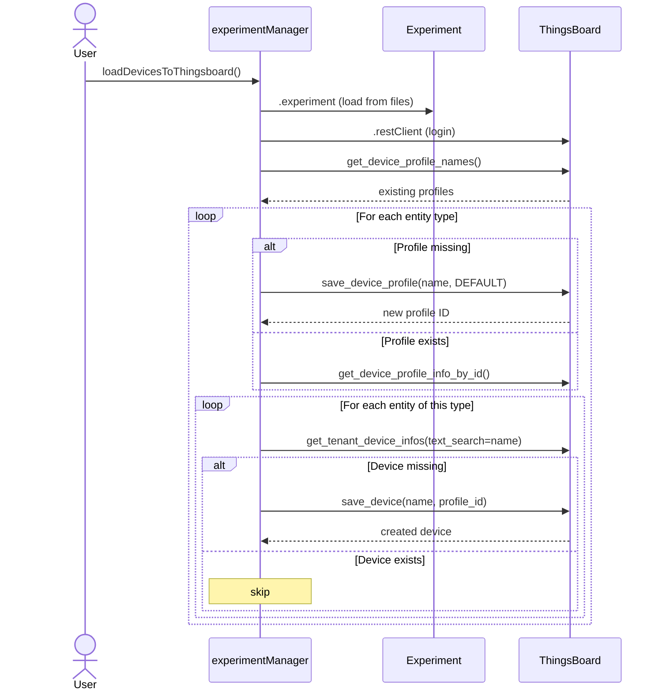
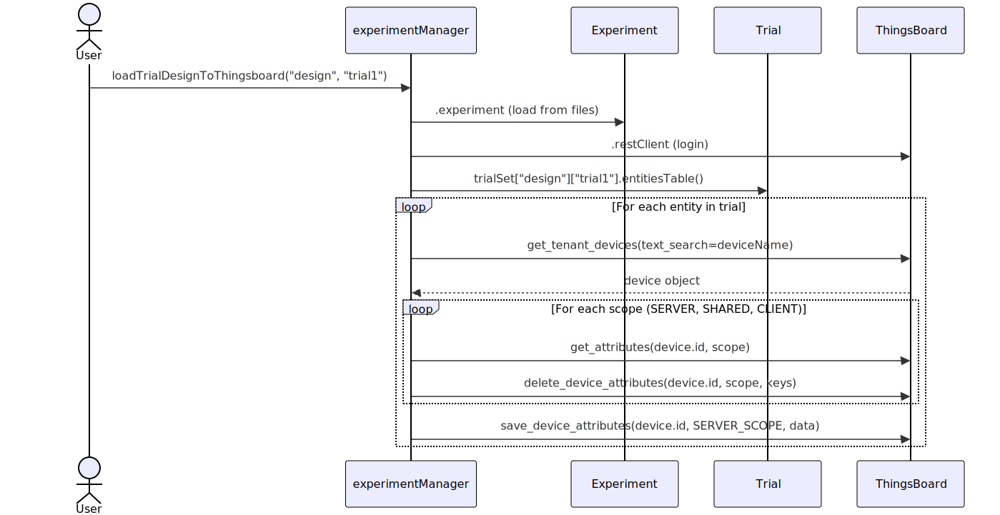
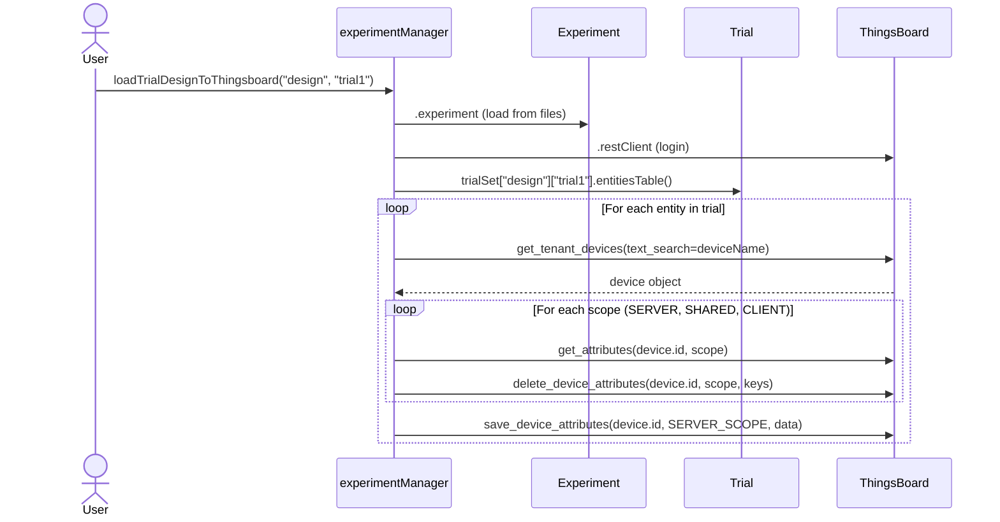

# Experiment Manager API

**Module:** `argos.manager`

The `experimentManager` class is the bridge between experiment metadata (loaded from files via `experimentSetup`) and the ThingsBoard IoT platform.

---

## Role in the System

```
                    experimentSetup
                    (load ZIP/JSON)
                          │
                          ▼
┌──────────────────────────────────────────┐
│          experimentManager               │
│                                          │
│  ┌──────────────┐   ┌────────────────┐   │
│  │  Experiment   │   │  ThingsBoard   │   │
│  │  (from files) │──>│  REST Client   │   │
│  └──────────────┘   └────────────────┘   │
│                            │             │
│                            ▼             │
│                     Create profiles      │
│                     Create devices       │
│                     Upload trial attrs   │
│                     Get credentials      │
│                     Clear devices        │
└──────────────────────────────────────────┘
```

The manager does **not** own the experiment data — it delegates to `fileExperimentFactory` for that. Its job is to orchestrate the ThingsBoard operations that deploy the experiment to the IoT platform.

---

## Class Dependency



<!-- mermaid source (for editing, paste into mermaid.live):

-->

**Implementation note:** Both `restClient` and `experiment` are properties that create a **new instance on each access** — the manager does not cache them. This means each method call gets a fresh ThingsBoard connection and a fresh experiment load. This is intentional for correctness (the experiment files may change between calls) but has a performance cost.

---

## Swimlane: Load Devices to ThingsBoard



<!-- mermaid source (for editing, paste into mermaid.live):

-->

## Swimlane: Upload Trial to ThingsBoard



<!-- mermaid source (for editing, paste into mermaid.live):

-->

---

## Module Constants

::: argos.manager.SERVER_SCOPE
    options:
      show_root_heading: true
      heading_level: 4

::: argos.manager.SHARED_SCOPE
    options:
      show_root_heading: true
      heading_level: 4

::: argos.manager.CLIENT_SCOPE
    options:
      show_root_heading: true
      heading_level: 4

---

## experimentManager

::: argos.manager.experimentManager
    options:
      show_root_heading: true
      heading_level: 3
      members:
        - __init__
        - experimentDirectory
        - configuration
        - TBConfiguration
        - restClient
        - experiment
        - loadConfigutation
        - loadDevicesToThingsboard
        - loadTrialDesignToThingsboard
        - loadTrialDeployToThingsboard
        - loadTrialToThingsboard
        - getDeviceMap
        - clearDevicesFromThingsboard
