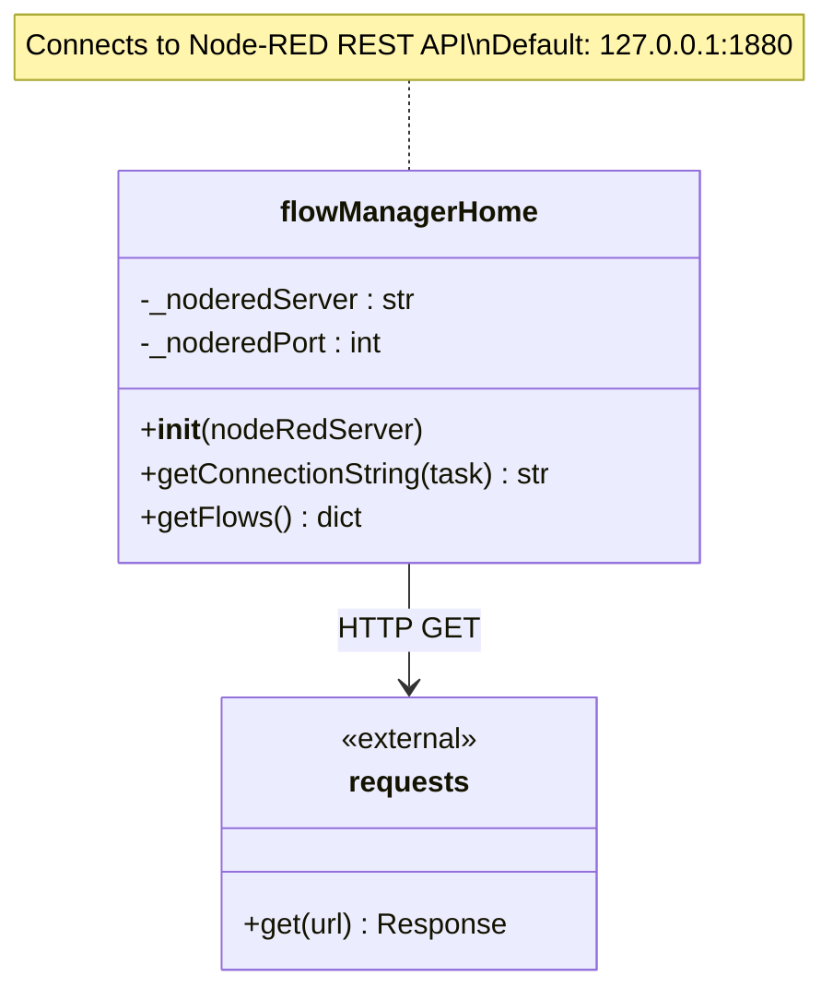
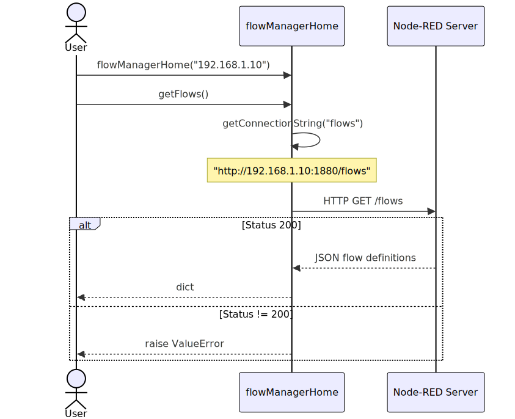
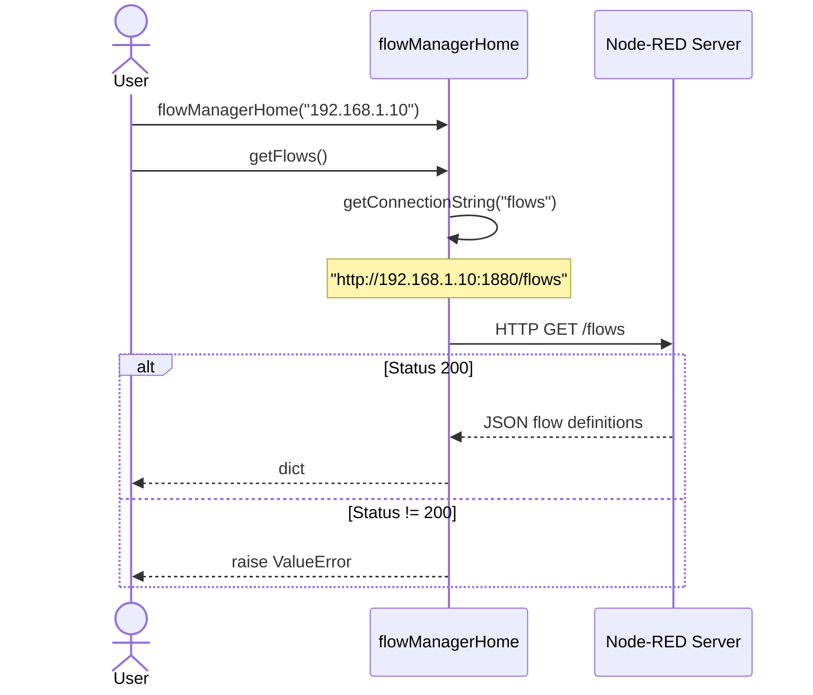

# Node-RED API

**Module:** `argos.nodered`

The Node-RED module provides integration with [Node-RED](https://nodered.org/) for device data routing and normalization.

---

## Role in the System

Node-RED sits between physical devices and Kafka in the data pipeline:

```
Devices ──MQTT/UDP──> Node-RED ──> Kafka topics
                         │
                    ┌────┴─────┐
                    │ pyArgos  │
                    │ nodered  │
                    │ module   │
                    ├──────────┤
                    │ manager/ │  REST client to query flows
                    │ nodes/   │  Custom Node-RED nodes:
                    │          │  - to_parquet (write data)
                    │          │  - add_document (TB transform)
                    └──────────┘
```

Node-RED performs the **normalization** step:

- Adds a consistent timestamp to each message
- Parses device-specific raw data formats
- Routes messages to the correct Kafka topic by device type

---

## Module Structure

```
argos/nodered/
    manager/
        flowManagerHome.py    # REST client to Node-RED server
    nodes/
        heraNodes.py          # to_parquet: write messages to Parquet
        tbNodes.py            # add_document: ThingsBoard payload transform
```

## Class Dependency



<!-- mermaid source (for editing, paste into mermaid.live):

-->

---

## Swimlane: Get Flows from Node-RED



<!-- mermaid source (for editing, paste into mermaid.live):

-->

---

## Implementation Notes

- The flow manager is a **read-only** client — it queries flows but does not modify them
- The Node-RED server address is configurable; port is hardcoded to **1880**
- The `to_parquet` custom node uses **Dask with fastparquet** for efficient writes
- The `add_document` node is a simple payload transformation (currently converts to lowercase)

---

## Flow Manager

### flowManagerHome

::: argos.nodered.manager.flowManagerHome.flowManagerHome
    options:
      show_root_heading: true
      heading_level: 4
      members:
        - __init__
        - getConnectionString
        - getFlows
