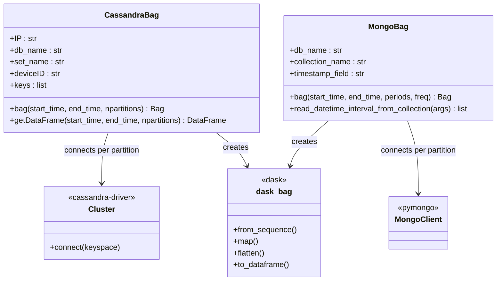
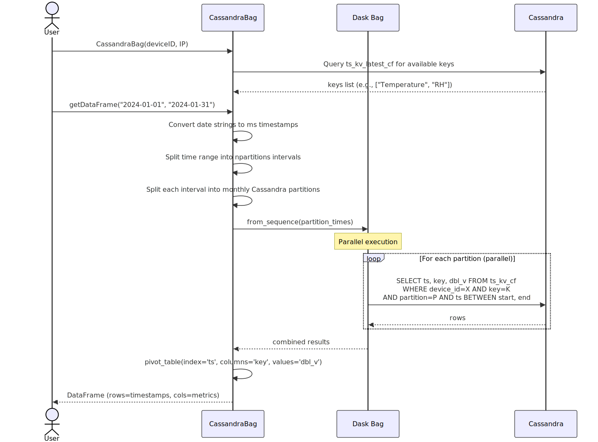
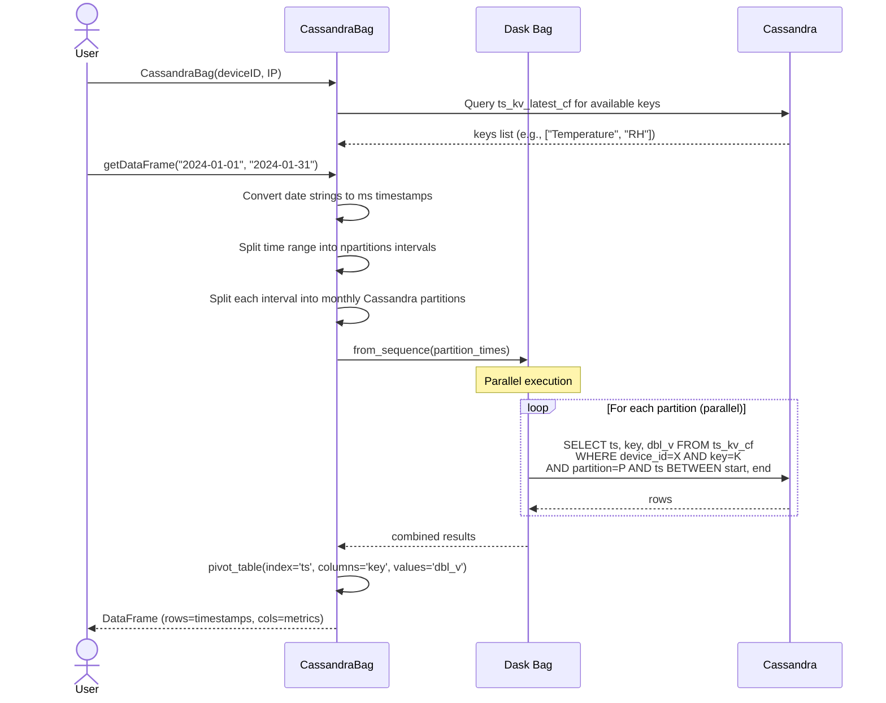
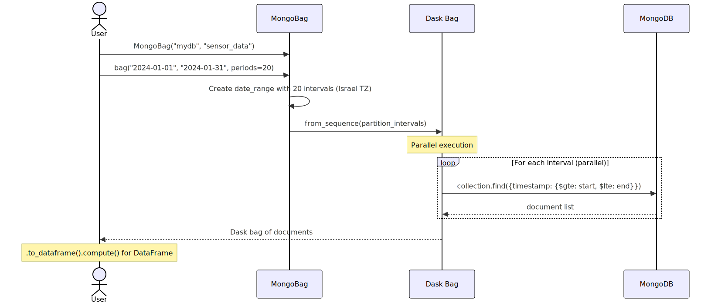
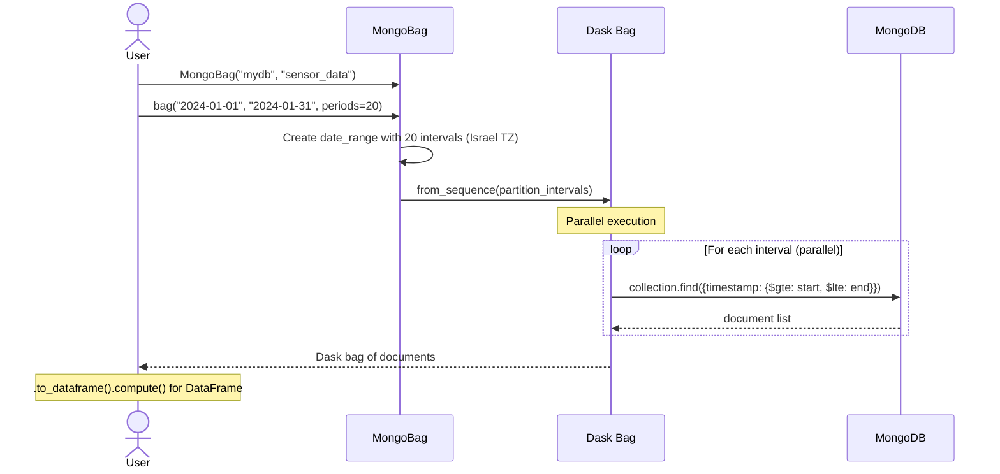

# NoSQL API (Cassandra & MongoDB)

**Module:** `argos.noSQLdask`

Dask-based interfaces for querying time-series data from Cassandra and MongoDB databases. These are used for accessing historical telemetry stored in ThingsBoard's Cassandra backend or in MongoDB collections.

---

## Role in the System

```
ThingsBoard ──stores telemetry──> Cassandra (ts_kv_cf)
                                      │
                                      ▼
                               CassandraBag ──> Dask bag ──> DataFrame
                                  (parallel partitioned reads)

MongoDB ──stores collections──> MongoBag ──> Dask bag ──> DataFrame
                                  (parallel partitioned reads)
```

Both classes follow the same pattern: split a time range into partitions, read each partition in parallel using Dask bags, and return the combined result as a Pandas DataFrame.

---

## Class Dependency



<!-- mermaid source (for editing, paste into mermaid.live):

-->

---

## Swimlane: Query Cassandra Telemetry



<!-- mermaid source (for editing, paste into mermaid.live):

-->

## Swimlane: Query MongoDB Collection



<!-- mermaid source (for editing, paste into mermaid.live):

-->

---

## Implementation Notes

**Cassandra-specific:**

- Designed for ThingsBoard's `ts_kv_cf` table schema: `(entity_type, entity_id, key, partition, ts) → dbl_v`
- Cassandra partitions are monthly — the code splits time ranges at month boundaries to align with partition keys
- A new Cluster/Session is created **per partition read** (no connection pooling)
- Only `dbl_v` (double values) are read; string/boolean/long values are ignored

**MongoDB-specific:**

- Time range queries use string comparison on the timestamp field (format: `%Y-%-m-%-d %-H:%-M:%-S.%f`)
- Additional query filters can be passed as `**kwargs` to `bag()`
- Uses `pymongo.MongoClient()` context manager per partition (default localhost)

**Shared pattern:**

- Both classes use `dask.bag.from_sequence().map().flatten()` for parallelism
- The number of partitions controls parallelism — more partitions = more parallel reads
- Neither class handles connection failures or retries

---

## CassandraBag

::: argos.noSQLdask.cassandraBag.CassandraBag
    options:
      show_root_heading: true
      heading_level: 3
      members:
        - __init__
        - bag
        - getDataFrame

---

## MongoBag

::: argos.noSQLdask.mongoBag.MongoBag
    options:
      show_root_heading: true
      heading_level: 3
      members:
        - __init__
        - db_name
        - collection_name
        - timestamp_field
        - bag
        - read_datetime_interval_from_collection
