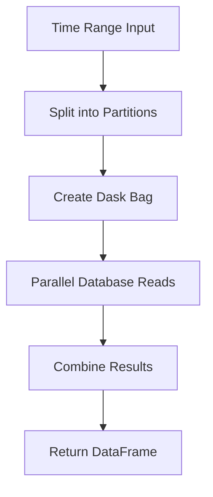

# NoSQL API (Cassandra & MongoDB)

**Module:** `argos.noSQLdask`

Dask-based interfaces for querying time-series data from Cassandra and MongoDB databases.

---

## CassandraBag

**Module:** `argos.noSQLdask.cassandraBag`

Interface to Cassandra time-series data, designed for querying the ThingsBoard backend.

```python
from argos.noSQLdask.cassandraBag import CassandraBag

bag = CassandraBag(deviceID="device-uuid-here")
df = bag.getDataFrame("2024-01-01", "2024-01-31")
```

### `__init__(deviceID, IP, db_name, set_name)`

| Parameter | Type | Default | Description |
|-----------|------|---------|-------------|
| `deviceID` | `str` | - | Device UUID to query |
| `IP` | `str` | `'127.0.0.1'` | Cassandra node IP |
| `db_name` | `str` | `'thingsboard'` | Database name |
| `set_name` | `str` | `'ts_kv_cf'` | Table name |

### Methods

#### `bag(start_time, end_time, npartitions=10)`

Returns a Dask bag for distributed processing.

| Parameter | Type | Description |
|-----------|------|-------------|
| `start_time` | `str` or `int` | Start of time range |
| `end_time` | `str` or `int` | End of time range |
| `npartitions` | `int` | Number of parallel partitions |

- Accepts string dates (e.g., `"2024-01-01"`) or millisecond timestamps
- Splits the time range across monthly partition boundaries
- Returns a Dask bag for lazy, parallel evaluation

#### `getDataFrame(start_time, end_time, npartitions=10)`

Returns a pivoted Pandas DataFrame.

| Returns | Description |
|---------|-------------|
| `DataFrame` | Rows = timestamps, Columns = metric keys, Values = `dbl_v` |

---

## MongoBag

**Module:** `argos.noSQLdask.mongoBag`

Interface to MongoDB time-series collections.

```python
from argos.noSQLdask.mongoBag import MongoBag

bag = MongoBag(db_name="mydb", collection_name="sensor_data")
dask_bag = bag.bag("2024-01-01", "2024-01-31", periods=20)
```

### `__init__(db_name, collection_name, datetimeField)`

| Parameter | Type | Default | Description |
|-----------|------|---------|-------------|
| `db_name` | `str` | - | MongoDB database name |
| `collection_name` | `str` | - | Collection name |
| `datetimeField` | `str` | `'timestamp'` | Timestamp field name |

### Methods

#### `bag(start_time, end_time, periods=10, freq=None, **qry)`

Returns a Dask bag for distributed processing.

| Parameter | Type | Default | Description |
|-----------|------|---------|-------------|
| `start_time` | `str` | - | Start of time range |
| `end_time` | `str` | - | End of time range |
| `periods` | `int` | `10` | Number of partitions |
| `freq` | `str` | `None` | Alternative: partition by frequency |
| `**qry` | `dict` | - | Additional MongoDB query filters |

- Creates date range partitions using `pandas.date_range`
- Supports additional MongoDB query filters via `**qry`
- Each partition is read in parallel

---

## Design Pattern

Both classes follow the same pattern:



This enables efficient querying of large time-series datasets by distributing reads across multiple partitions processed in parallel.
