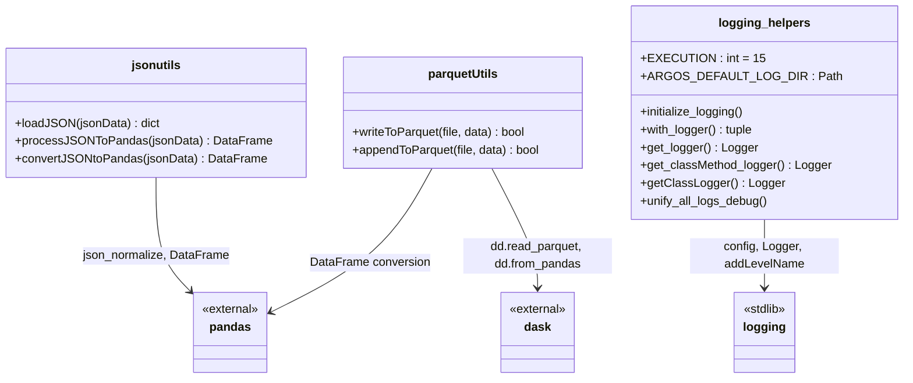
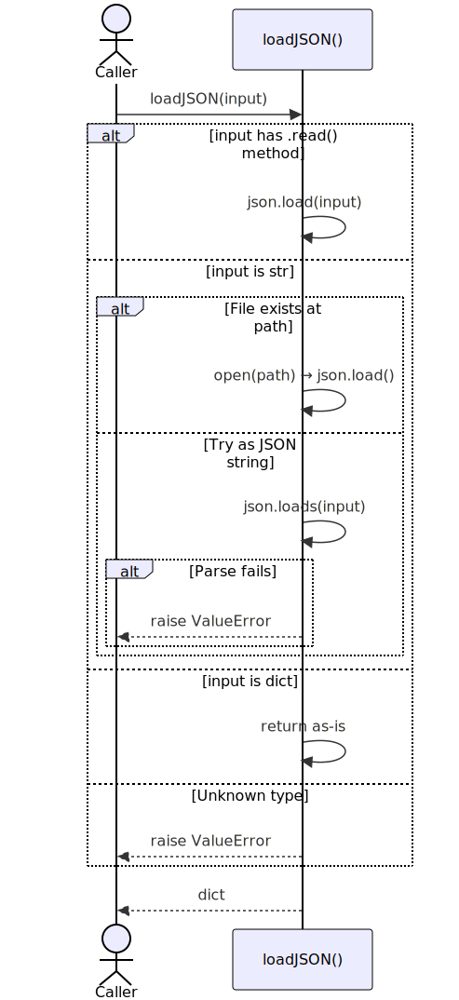
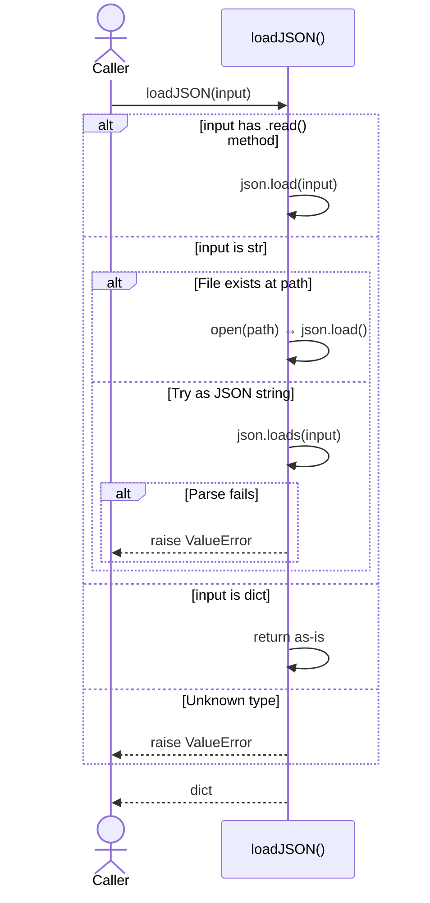
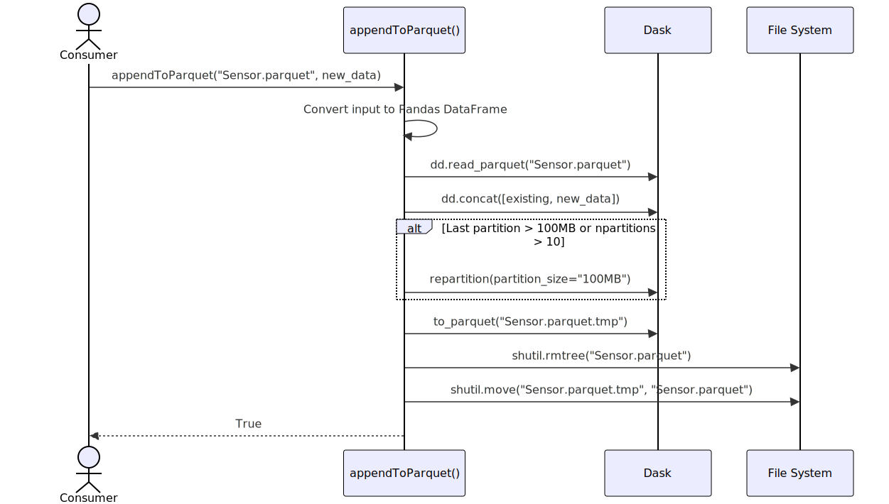
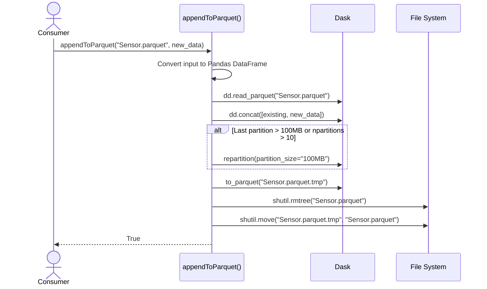

# Utilities API

**Module:** `argos.utils`

Utility modules providing JSON parsing, Parquet I/O, and logging infrastructure used throughout pyArgos.

---

## Module Structure

```
argos/utils/
    jsonutils.py          # Flexible JSON loading and flattening to DataFrames
    parquetUtils.py       # Parquet write and append with Dask
    logging/
        helpers.py        # Logger helpers, EXECUTION level, config initialization
        toolkit.py        # Legacy logging toolkit (deprecated)
        argosLogging.config  # Default logging configuration
```

## Class Dependency



<!-- mermaid source (for editing, paste into mermaid.live):

-->

---

## Swimlane: loadJSON (Flexible Input)



<!-- mermaid source (for editing, paste into mermaid.live):

-->

## Swimlane: Append to Parquet



<!-- mermaid source (for editing, paste into mermaid.live):

-->

---

## Implementation Notes

### JSON Utilities

- `loadJSON` accepts 4 input types: file object, file path string, JSON string, or dict — making it safe to call without knowing what you have
- `processJSONToPandas` flattens nested JSON to a 2-column DataFrame (path, value), handling nested lists by appending `_0`, `_1` suffixes
- `convertJSONtoPandas` recursively flattens using dot notation (`a.b.c`) — keeps flattening until all values are scalars
- `convertJSONtoConf` is **deprecated** — it uses `eval()` to convert string values to Python objects

### Parquet Utilities

- Both functions accept Pandas DataFrames, Dask DataFrames, or raw data (auto-converted)
- Uses **fastparquet** engine (not pyarrow)
- `appendToParquet` uses an **atomic write pattern**: write to `.tmp`, delete old, rename — prevents corruption on crash
- Auto-repartitions when partitions grow too large (>100MB) or too numerous (>10)
- The datetime column is used as the **Dask index** for time-based partitioning

### Logging

- Custom `EXECUTION` level (15) sits between DEBUG (10) and INFO (20) — used for step-by-step progress messages throughout pyArgos
- Config is read from `~/.pyargos/log/argosLogging.config` — created from package defaults on first use
- `get_logger(instance)` returns a logger named after the instance's class (e.g., `argos.manager.experimentManager`)
- `unify_all_logs_debug()` merges all loggers to root — useful for debugging but not production

---

## JSON Utilities

**Module:** `argos.utils.jsonutils`

### loadJSON

::: argos.utils.jsonutils.loadJSON
    options:
      show_root_heading: true
      heading_level: 4

---

### processJSONToPandas

::: argos.utils.jsonutils.processJSONToPandas
    options:
      show_root_heading: true
      heading_level: 4

---

### convertJSONtoPandas

::: argos.utils.jsonutils.convertJSONtoPandas
    options:
      show_root_heading: true
      heading_level: 4

---

### convertJSONtoConf

::: argos.utils.jsonutils.convertJSONtoConf
    options:
      show_root_heading: true
      heading_level: 4

---

## Parquet Utilities

**Module:** `argos.utils.parquetUtils`

### writeToParquet

::: argos.utils.parquetUtils.writeToParquet
    options:
      show_root_heading: true
      heading_level: 4

---

### appendToParquet

::: argos.utils.parquetUtils.appendToParquet
    options:
      show_root_heading: true
      heading_level: 4

---

## Logging

**Module:** `argos.utils.logging.helpers`

### initialize_logging

::: argos.utils.logging.helpers.initialize_logging
    options:
      show_root_heading: true
      heading_level: 4

---

### with_logger

::: argos.utils.logging.helpers.with_logger
    options:
      show_root_heading: true
      heading_level: 4

---

### get_logger

::: argos.utils.logging.helpers.get_logger
    options:
      show_root_heading: true
      heading_level: 4

---

### get_classMethod_logger

::: argos.utils.logging.helpers.get_classMethod_logger
    options:
      show_root_heading: true
      heading_level: 4

---

### getClassLogger

::: argos.utils.logging.helpers.getClassLogger
    options:
      show_root_heading: true
      heading_level: 4

---

### unify_all_logs_debug

::: argos.utils.logging.helpers.unify_all_logs_debug
    options:
      show_root_heading: true
      heading_level: 4
