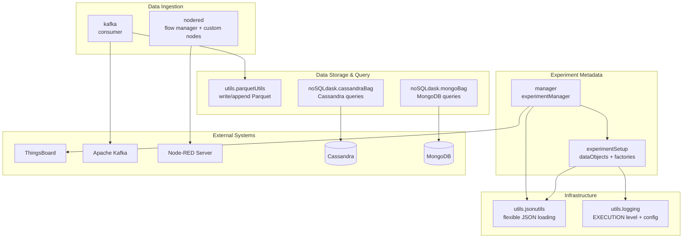
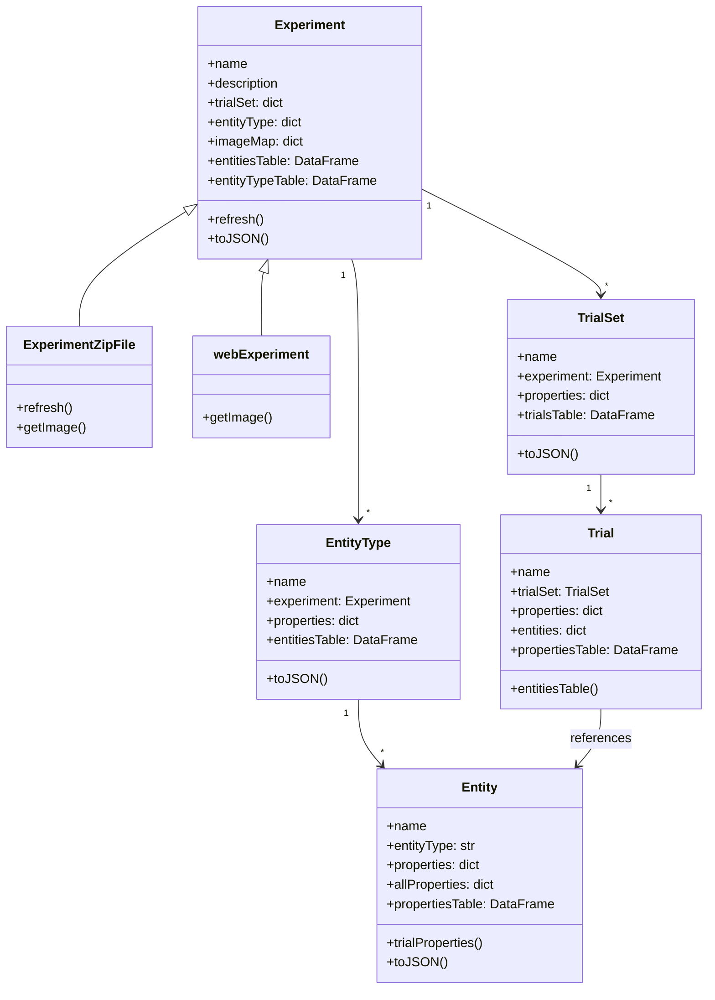
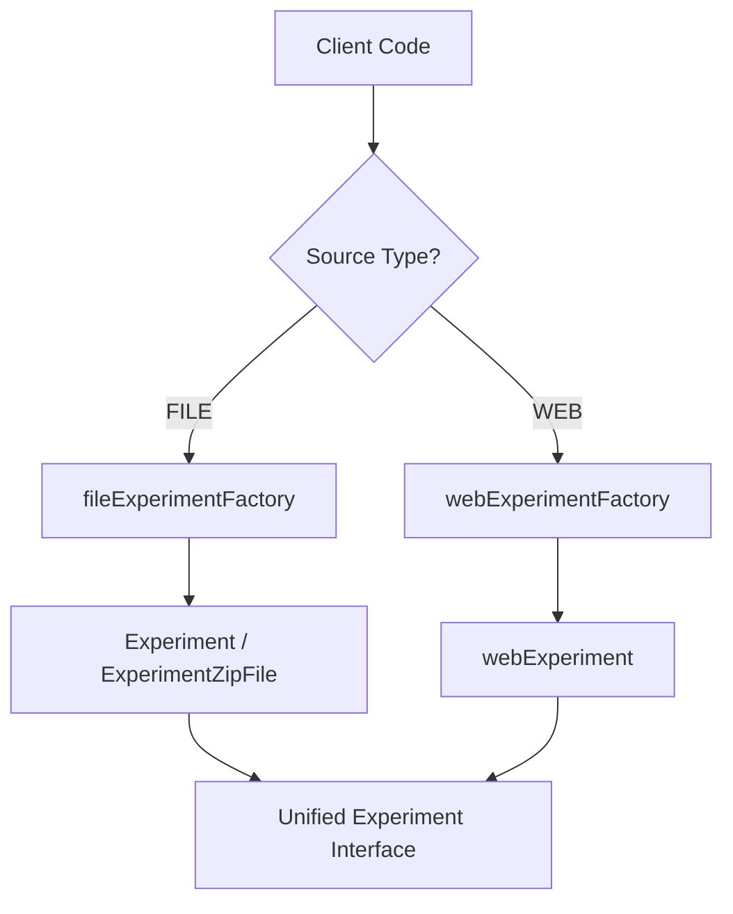
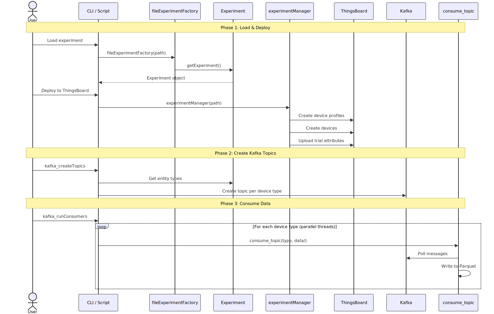
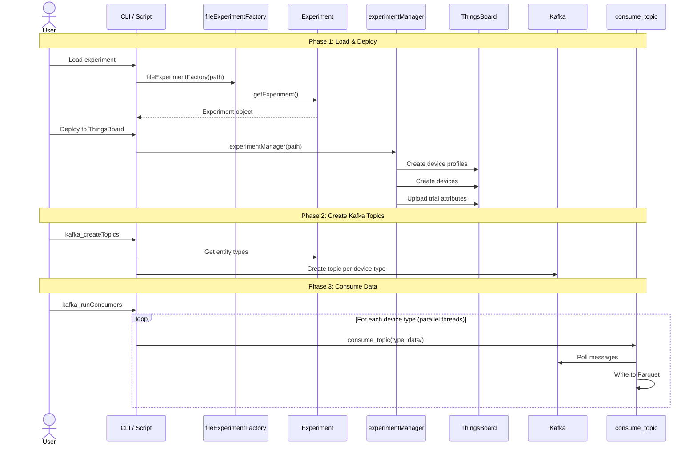
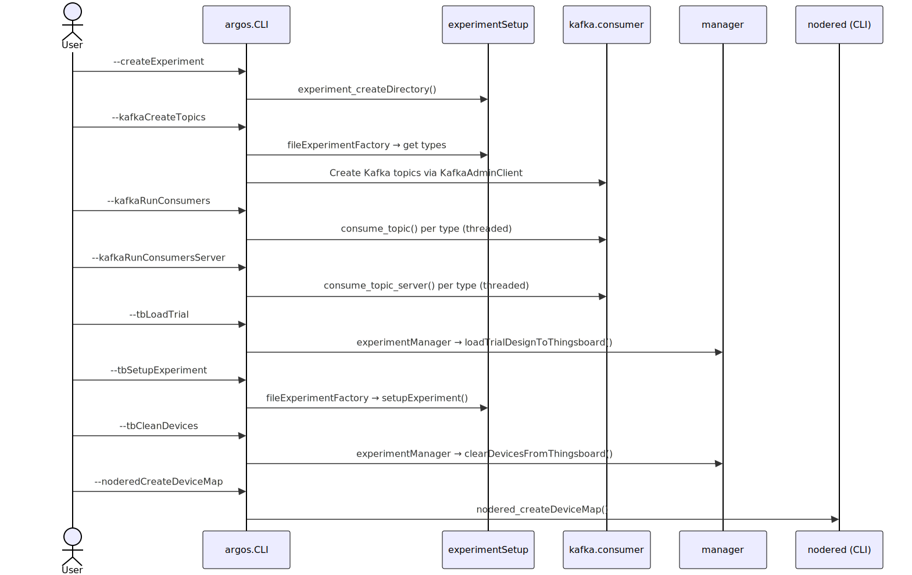
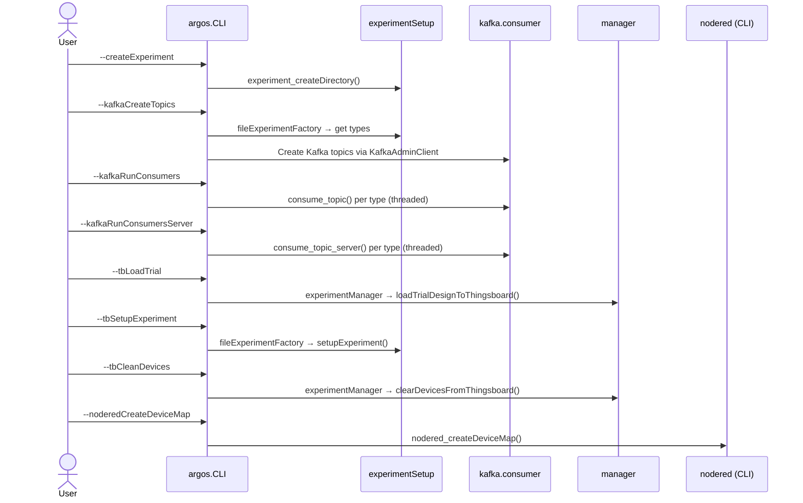

# Core Concepts

This page describes the architecture and design patterns that underpin the entire pyArgos system — how all modules fit together, their dependencies, and the key design decisions.

---

## System-Wide Module Map



<!-- mermaid source (for editing, paste into mermaid.live):

-->

---

## Module Dependency Matrix

| Module | Depends on (internal) | Depends on (external) |
|--------|----------------------|----------------------|
| `experimentSetup` | `utils.jsonutils`, `utils.logging` | `gql` (optional, for web), `matplotlib`, `requests` |
| `manager` | `experimentSetup`, `utils.jsonutils`, `utils.logging` | `tb_rest_client` (optional) |
| `kafka.consumer` | `utils.parquetUtils` | `kafka-python`, `numpy`, `pandas` |
| `CLI` | `experimentSetup`, `kafka.consumer`, `manager` | `kafka-python` |
| `nodered.manager` | — | `requests` |
| `nodered.nodes` | — | `dask`, `fastparquet`, `pandas` |
| `noSQLdask.cassandraBag` | — | `cassandra-driver`, `dask`, `pandas` |
| `noSQLdask.mongoBag` | — | `pymongo`, `dask`, `pandas` |
| `utils.jsonutils` | — | `pandas` |
| `utils.parquetUtils` | — | `dask`, `pandas`, `shutil` |
| `utils.logging` | — | `logging` (stdlib) |

**Design principle:** Modules at the bottom of the stack (`utils`, `noSQLdask`) have **no internal dependencies** — they only depend on external libraries. Higher-level modules (`manager`, `CLI`) depend on lower-level ones. This avoids circular imports.

---

## Class Hierarchy

pyArgos organizes experiment data in a hierarchical object model:



<!-- mermaid source (for editing, paste into mermaid.live):

-->

See [Experiment Setup Architecture](experiment_setup.md) for the full deep-dive.

---

## Factory Pattern

pyArgos uses the Factory pattern to abstract experiment loading from different sources:



<!-- mermaid source (for editing, paste into mermaid.live):

-->

### `fileExperimentFactory`

- Loads from a local directory
- Auto-detects ZIP vs extracted JSON format
- Handles version migrations (1.0.0 through 3.0.0)
- Default: uses current working directory

### `webExperimentFactory`

- Fetches from ArgosWEB via GraphQL
- Requires server URL and authentication token
- Retrieves entity types, entities, trial sets, and trials
- Images are fetched via HTTP on demand

---

## Swimlane: Full Experiment Deployment

This diagram shows the complete flow from loading an experiment to deploying it on ThingsBoard and starting data collection:



<!-- mermaid source (for editing, paste into mermaid.live):

-->

---

## Swimlane: CLI Command Routing

The CLI (`argos.CLI`) routes user commands to the appropriate module:



<!-- mermaid source (for editing, paste into mermaid.live):

-->

---

## Property Type System

Entities and trials have typed properties. The `Trial` class includes parsers for each type:

| Property Type | Parser | Output |
|---------------|--------|--------|
| `location` | `_parseProperty_location` | `{name, latitude, longitude}` |
| `text` | `_parseProperty_text` | String value |
| `textArea` | `_parseProperty_textArea` | String value |
| `number` | `_parseProperty_number` | Numeric value |
| `boolean` | `_parseProperty_boolean` | Boolean value |
| `datetime_local` | `_parseProperty_datetime_local` | Datetime (Israel timezone) |
| `selectList` | `_parseProperty_selectList` | Selected value from predefined options |

---

## Container Hierarchy Resolution

The `fillContained` module resolves entity hierarchies where entities can be contained within other entities:

```python
fill_properties_by_contained(entities_types_dict, meta_entities)
```

This function:

1. Traverses the "contains" relationships between entities
2. Inherits parent properties to child entities
3. Handles property type conversion (Number, String)
4. Spreads flattened attributes (e.g., `location` -> `mapName`, `latitude`, `longitude`)

---

## Pandas as Data Interface

A key design decision in pyArgos is exposing data as Pandas DataFrames wherever possible:

- `experiment.entitiesTable` - All entities as a flat DataFrame
- `experiment.entityTypeTable` - Entity types summary
- `trialSet.trialsTable` - All trials in a set
- `trial.propertiesTable` - Trial-level properties
- `entity.propertiesTable` - Entity constant properties
- `entity.allPropertiesTable` - All properties including trial-specific

This makes it easy to filter, join, and analyze experiment metadata using standard Pandas operations.

---

## Design Decisions

### Why optional external dependencies?

ThingsBoard (`tb_rest_client`), GraphQL (`gql`), Cassandra (`cassandra-driver`), and MongoDB (`pymongo`) are all optional. pyArgos gracefully handles their absence with try/except imports. This allows users to install only what they need — a researcher doing offline analysis doesn't need ThingsBoard, and a deployment engineer doesn't need Cassandra.

### Why threads for Kafka consumers?

The CLI starts one thread per device type topic (`threading.Thread`). This is simpler than multiprocessing and sufficient because the bottleneck is Kafka I/O and Parquet writes, not CPU. Each thread is independent — one topic's consumer has no effect on another.

### Why Dask for Parquet and NoSQL?

Dask provides lazy evaluation and partitioned I/O, which is important for:
- **Parquet:** Auto-repartitioning when files grow large (>100MB partitions)
- **Cassandra:** Parallel reads across monthly partitions
- **MongoDB:** Parallel reads across time-range partitions

### Why a custom EXECUTION log level?

pyArgos defines `EXECUTION = 15` (between DEBUG=10 and INFO=20) for step-by-step progress messages. This separates operational progress ("Creating experiment directories") from informational messages ("Found 3 devices") without polluting the DEBUG stream with low-level details.

---

## Version Compatibility

The `ExperimentZipFile` class handles multiple JSON schema versions:

| Version | Handler | Changes |
|---------|---------|---------|
| 1.0.0 | `_fix_json_version_1_0_0_` | Original format |
| 2.0.0 | `_fix_json_version_2_0_0_` | Updated entity structure |
| 3.0.0 | `_fix_json_version_3_0_0_` | Current format |

Version detection and migration is automatic when loading experiments.
