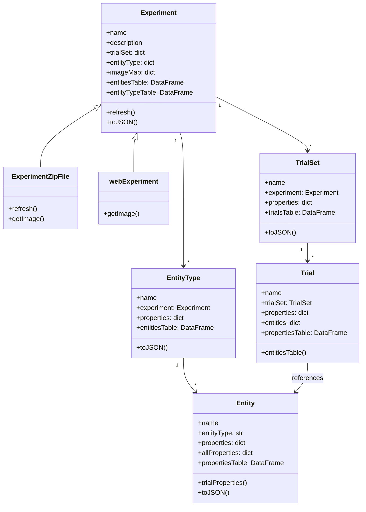
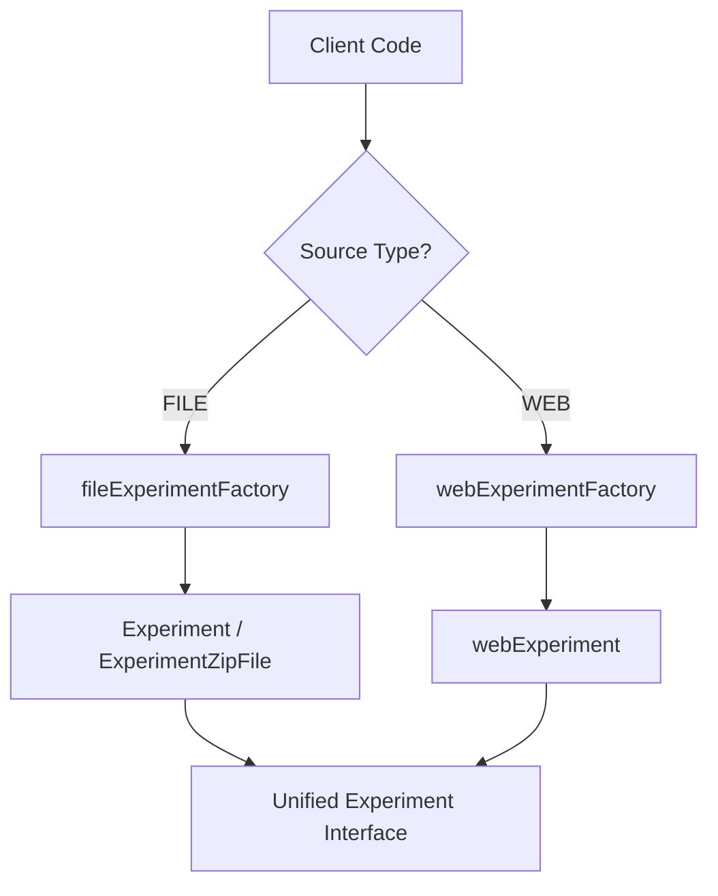

# Core Concepts

This page describes the architecture and design patterns that underpin pyArgos.

---

## Class Hierarchy

pyArgos organizes experiment data in a hierarchical object model:



---

## Factory Pattern

pyArgos uses the Factory pattern to abstract experiment loading from different sources:



### `fileExperimentFactory`

- Loads from a local directory
- Auto-detects ZIP vs extracted JSON format
- Handles version migrations (1.0.0 through 3.0.0)
- Default: uses current working directory

### `webExperimentFactory`

- Fetches from ArgosWEB via GraphQL
- Requires server URL and authentication token
- Retrieves entity types, entities, trial sets, and trials
- Images are fetched via HTTP on demand

---

## Property Type System

Entities and trials have typed properties. The `Trial` class includes parsers for each type:

| Property Type | Parser | Output |
|---------------|--------|--------|
| `location` | `_parseProperty_location` | `{name, latitude, longitude}` |
| `text` | `_parseProperty_text` | String value |
| `textArea` | `_parseProperty_textArea` | String value |
| `number` | `_parseProperty_number` | Numeric value |
| `boolean` | `_parseProperty_boolean` | Boolean value |
| `datetime_local` | `_parseProperty_datetime_local` | Datetime (Israel timezone) |
| `selectList` | `_parseProperty_selectList` | Selected value from predefined options |

---

## Container Hierarchy Resolution

The `fillContained` module resolves entity hierarchies where entities can be contained within other entities:

```python
fill_properties_by_contained(entities_types_dict, meta_entities)
```

This function:

1. Traverses the "contains" relationships between entities
2. Inherits parent properties to child entities
3. Handles property type conversion (Number, String)
4. Spreads flattened attributes (e.g., `location` -> `mapName`, `latitude`, `longitude`)

---

## Pandas as Data Interface

A key design decision in pyArgos is exposing data as Pandas DataFrames wherever possible:

- `experiment.entitiesTable` - All entities as a flat DataFrame
- `experiment.entityTypeTable` - Entity types summary
- `trialSet.trialsTable` - All trials in a set
- `trial.propertiesTable` - Trial-level properties
- `entity.propertiesTable` - Entity constant properties
- `entity.allPropertiesTable` - All properties including trial-specific

This makes it easy to filter, join, and analyze experiment metadata using standard Pandas operations.

---

## Version Compatibility

The `ExperimentZipFile` class handles multiple JSON schema versions:

| Version | Handler | Changes |
|---------|---------|---------|
| 1.0.0 | `_fix_json_version_1_0_0_` | Original format |
| 2.0.0 | `_fix_json_version_2_0_0_` | Updated entity structure |
| 3.0.0 | `_fix_json_version_3_0_0_` | Current format |

Version detection and migration is automatic when loading experiments.
