# Data Flow

This page documents how data flows through the pyArgos system in different scenarios.

---

## Local Experiment Loading

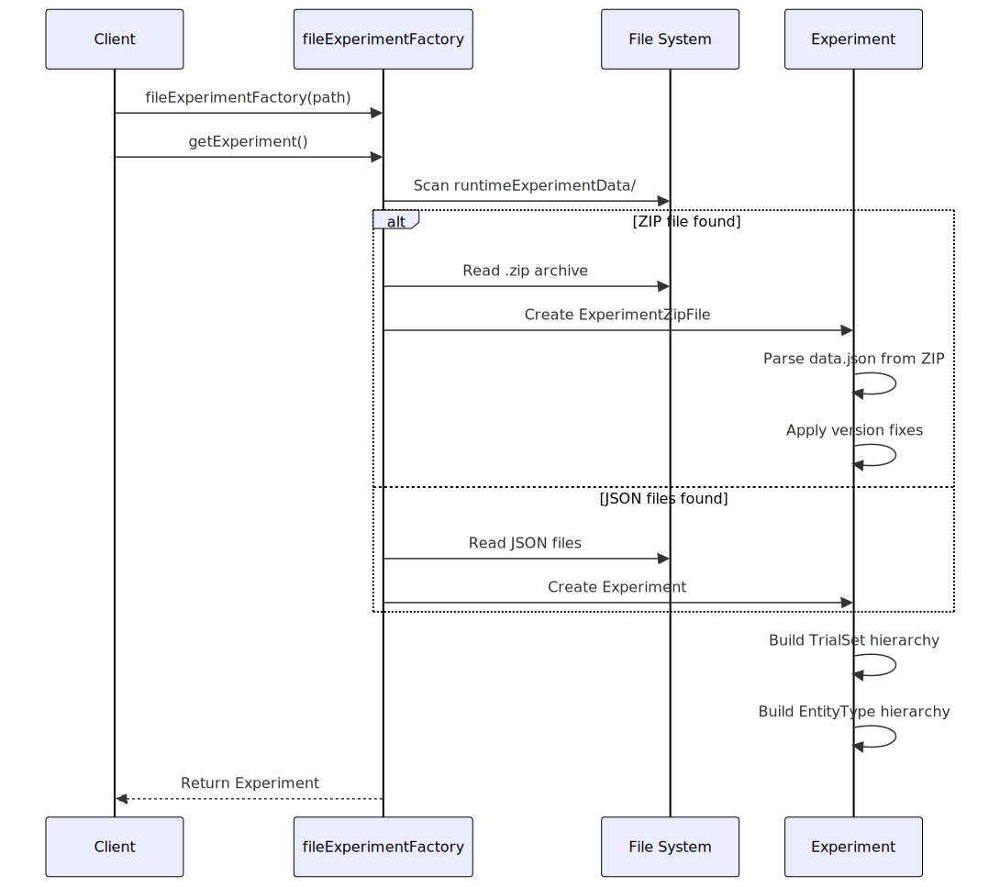

<!-- mermaid source (for editing, paste into mermaid.live):
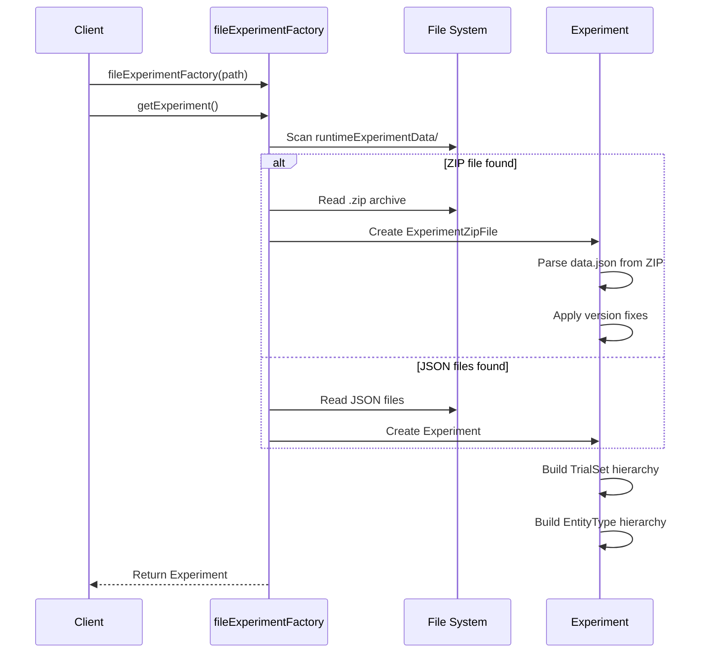
-->

---

## Remote Experiment Loading

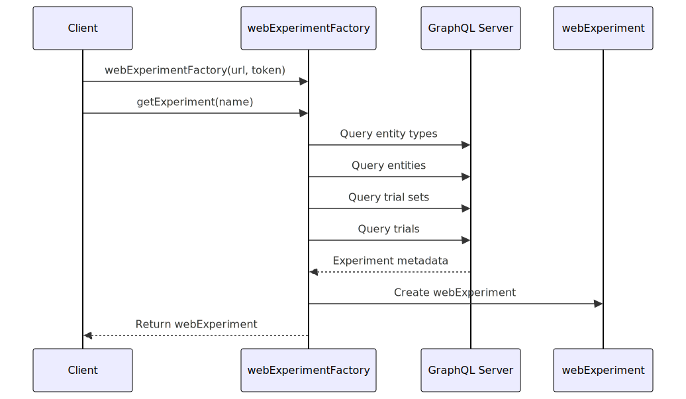

<!-- mermaid source (for editing, paste into mermaid.live):
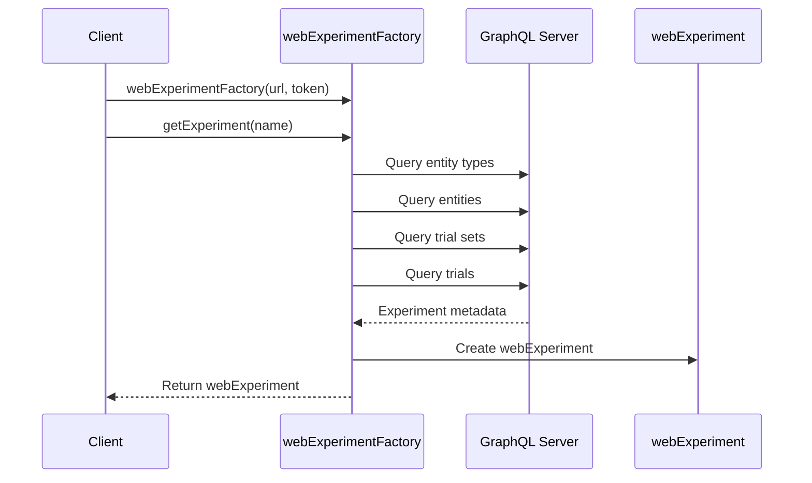
-->

---

## Kafka to Parquet Pipeline

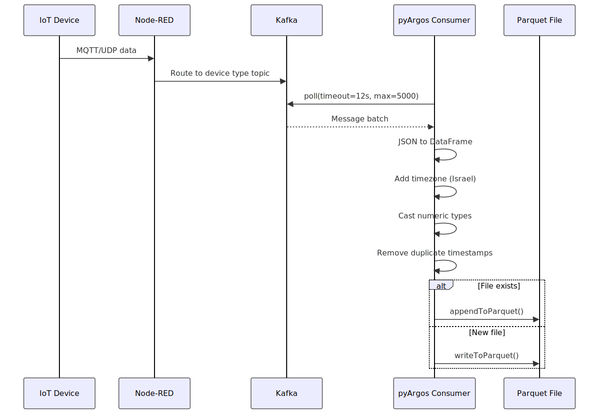

<!-- mermaid source (for editing, paste into mermaid.live):
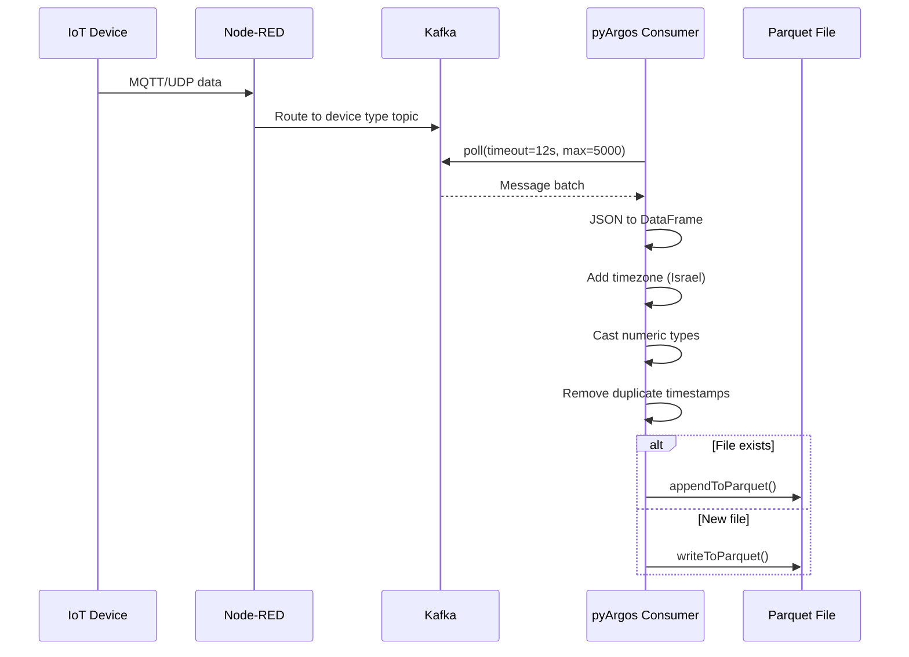
-->

### Parquet Write Strategy

The `appendToParquet` function uses a safe write pattern:

1. Load existing Parquet file with Dask
2. Concatenate with new data
3. Auto-repartition if:
    - Last partition exceeds 100MB
    - Total partitions exceed 10
4. Write to temporary file
5. Atomic rename to final path

---

## ThingsBoard Setup Flow

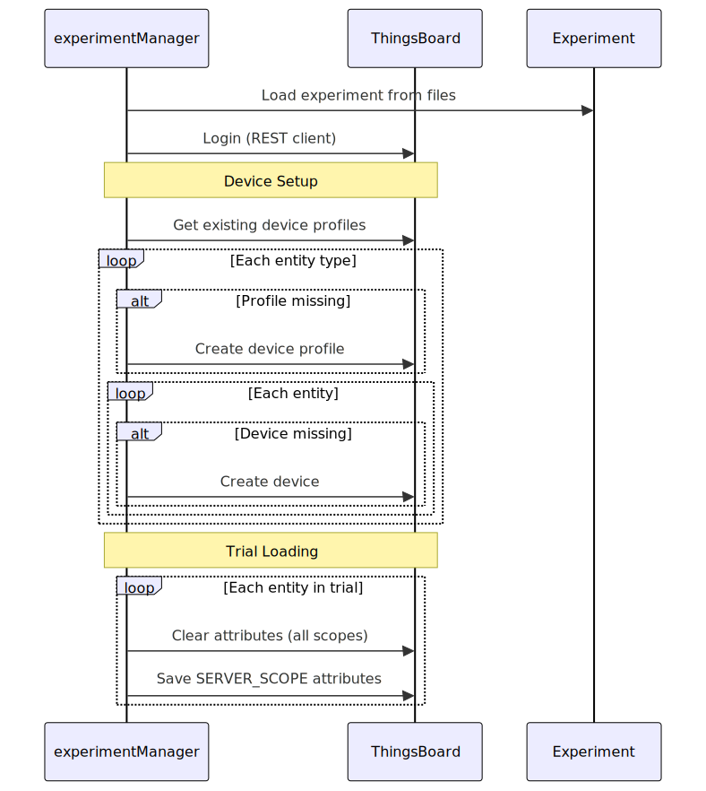

<!-- mermaid source (for editing, paste into mermaid.live):
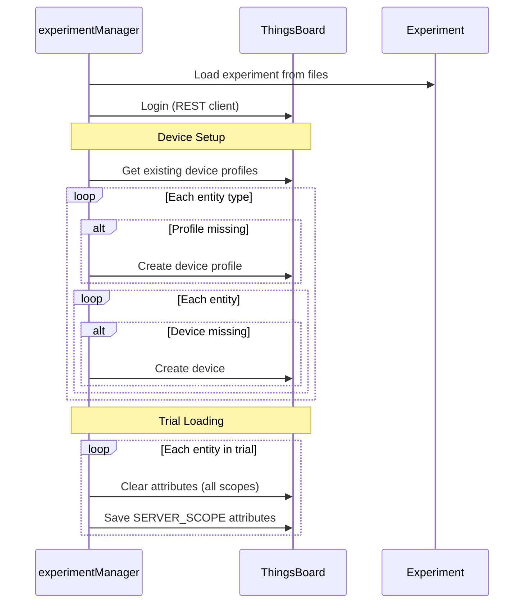
-->

---

## NoSQL Query Flow

### Cassandra


<!-- mermaid source (for editing, paste into mermaid.live):
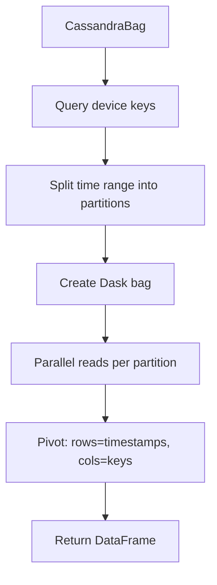
-->

### MongoDB


<!-- mermaid source (for editing, paste into mermaid.live):
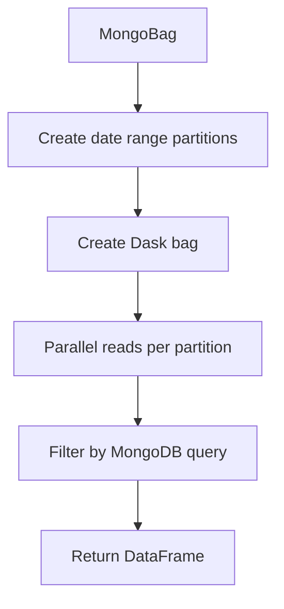
-->

Both use Dask for distributed processing, splitting time ranges into partitions for parallel reads from the database.
