# Experiment Setup Architecture

This page provides a deep architectural reference for the `argos.experimentSetup` module -- the core of pyArgos. It covers the inheritance hierarchy, object lifecycle, property system, data flow, and internal design decisions.

---

## Module Overview

The `experimentSetup` module is responsible for:

1. **Loading** experiment definitions from files (JSON/ZIP) or the ArgosWEB server (GraphQL)
2. **Parsing** the raw JSON into a typed object hierarchy
3. **Exposing** experiment metadata as Pandas DataFrames for analysis
4. **Resolving** entity containment hierarchies (parent-child property inheritance)
5. **Handling** schema version migrations across different ArgosWEB exports

### File Layout

```
argos/experimentSetup/
    __init__.py                 # Module entry point, WEB/FILE constants
    dataObjectsFactory.py       # Factory classes (file, web)
    dataObjects.py              # Data object hierarchy (Experiment, Trial, Entity, ...)
    fillContained.py            # Containment hierarchy resolution
    runner.py                   # Development/test runner script
    example_exp/                # Example experiment data for testing
```

---

## Inheritance Hierarchy

### Experiment Classes

The `Experiment` base class defines the full interface for accessing experiment data. Two subclasses override only the data-loading and image-fetching behavior:



<!-- mermaid source (for editing, paste into mermaid.live):
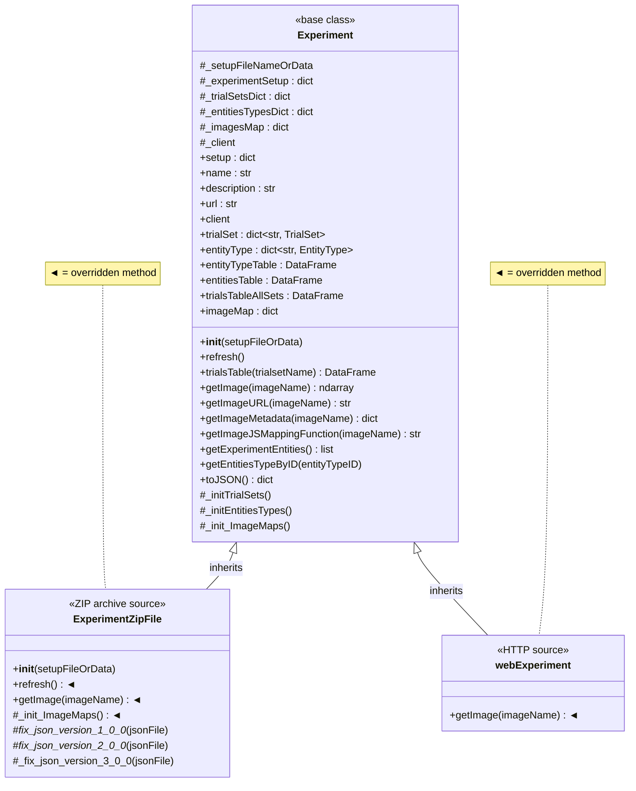
```mermaid
classDiagram
    class Experiment {
        <<base class>>
        #_setupFileNameOrData
        #_experimentSetup : dict
        #_trialSetsDict : dict
        #_entitiesTypesDict : dict
        #_imagesMap : dict
        #_client
        +__init__(setupFileOrData)
        +refresh()
        +setup : dict
        +name : str
        +description : str
        +url : str
        +client
        +trialSet : dict~str, TrialSet~
        +entityType : dict~str, EntityType~
        +entityTypeTable : DataFrame
        +entitiesTable : DataFrame
        +trialsTableAllSets : DataFrame
        +trialsTable(trialsetName) DataFrame
        +imageMap : dict
        +getImage(imageName) ndarray
        +getImageURL(imageName) str
        +getImageMetadata(imageName) dict
        +getImageJSMappingFunction(imageName) str
        +getExperimentEntities() list
        +getEntitiesTypeByID(entityTypeID)
        +toJSON() dict
        #_initTrialSets()
        #_initEntitiesTypes()
        #_init_ImageMaps()
    }

    class ExperimentZipFile {
        <<ZIP archive source>>
        +__init__(setupFileOrData)
        +refresh()◄
        +getImage(imageName)◄
        #_init_ImageMaps()◄
        #_fix_json_version_1_0_0_(jsonFile)
        #_fix_json_version_2_0_0_(jsonFile)
        #_fix_json_version_3_0_0(jsonFile)
    }

    class webExperiment {
        <<HTTP source>>
        +getImage(imageName)◄
    }

    Experiment <|-- ExperimentZipFile : inherits
    Experiment <|-- webExperiment : inherits

    note for ExperimentZipFile "◄ = overridden method"
    note for webExperiment "◄ = overridden method"
```
-->

**Key override points:**

| Method | Experiment (base) | ExperimentZipFile | webExperiment |
|--------|-------------------|-------------------|---------------|
| `refresh()` | Loads JSON from file/dict | Extracts `data.json` from ZIP, applies version migration | Inherited (uses base) |
| `getImage()` | Reads from local filesystem path | Reads from inside the ZIP archive | Fetches via HTTP GET |
| `_init_ImageMaps()` | Parses `experimentsWithData.maps` with full URLs | Parses `maps` from ZIP metadata (no URLs) | Inherited (uses base) |

### Container Classes (dict-based)

Both `TrialSet` and `EntityType` extend Python's `dict`, enabling dictionary-style access to their children:



<!-- mermaid source (for editing, paste into mermaid.live):
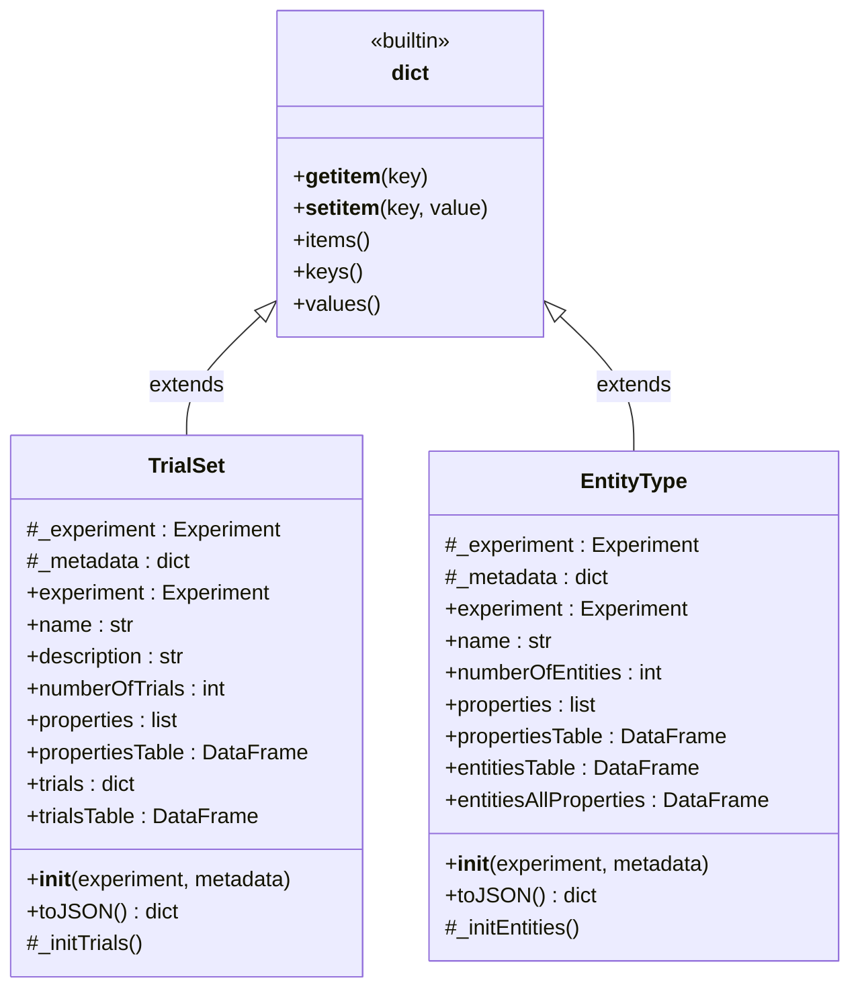
```mermaid
classDiagram
    class dict {
        <<builtin>>
        +__getitem__(key)
        +__setitem__(key, value)
        +items()
        +keys()
        +values()
    }

    class TrialSet {
        #_experiment : Experiment
        #_metadata : dict
        +__init__(experiment, metadata)
        +experiment : Experiment
        +name : str
        +description : str
        +numberOfTrials : int
        +properties : list
        +propertiesTable : DataFrame
        +trials : dict
        +trialsTable : DataFrame
        +toJSON() dict
        #_initTrials()
    }

    class EntityType {
        #_experiment : Experiment
        #_metadata : dict
        +__init__(experiment, metadata)
        +experiment : Experiment
        +name : str
        +numberOfEntities : int
        +properties : list
        +propertiesTable : DataFrame
        +entitiesTable : DataFrame
        +entitiesAllProperties : DataFrame
        +toJSON() dict
        #_initEntities()
    }

    dict <|-- TrialSet : extends
    dict <|-- EntityType : extends
```
-->

This means:

```python
# TrialSet acts as a dict of Trial objects
trial = experiment.trialSet["design"]["myTrial"]

# EntityType acts as a dict of Entity objects
entity = experiment.entityType["Sensor"]["Sensor_01"]
```

### Full Object Composition



<!-- mermaid source (for editing, paste into mermaid.live):
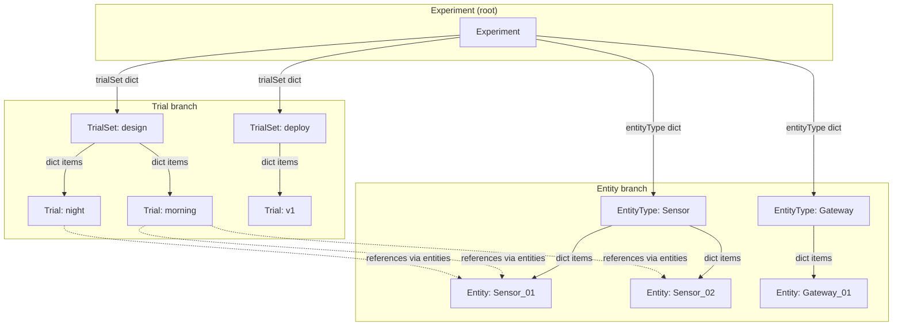
```mermaid
graph TD
    subgraph "Experiment (root)"
        EXP[Experiment]
    end

    subgraph "Entity branch"
        ET1[EntityType: Sensor]
        ET2[EntityType: Gateway]
        E1[Entity: Sensor_01]
        E2[Entity: Sensor_02]
        E3[Entity: Gateway_01]
    end

    subgraph "Trial branch"
        TS1[TrialSet: design]
        TS2[TrialSet: deploy]
        T1[Trial: morning]
        T2[Trial: night]
        T3[Trial: v1]
    end

    EXP -->|entityType dict| ET1
    EXP -->|entityType dict| ET2
    EXP -->|trialSet dict| TS1
    EXP -->|trialSet dict| TS2

    ET1 -->|dict items| E1
    ET1 -->|dict items| E2
    ET2 -->|dict items| E3

    TS1 -->|dict items| T1
    TS1 -->|dict items| T2
    TS2 -->|dict items| T3

    T1 -.->|references via entities| E1
    T1 -.->|references via entities| E2
    T2 -.->|references via entities| E1
```
-->

---

## Factory Pattern

### Decision Flow



<!-- mermaid source (for editing, paste into mermaid.live):
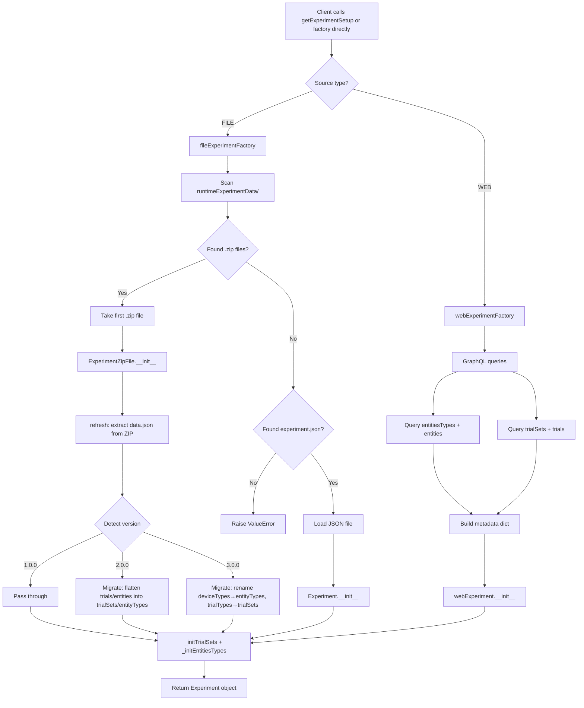
```mermaid
flowchart TD
    A[Client calls getExperimentSetup or factory directly] --> B{Source type?}

    B -->|FILE| C[fileExperimentFactory]
    B -->|WEB| D[webExperimentFactory]

    C --> E[Scan runtimeExperimentData/]
    E --> F{Found .zip files?}
    F -->|Yes| G[Take first .zip file]
    F -->|No| H{Found experiment.json?}
    H -->|Yes| I[Load JSON file]
    H -->|No| J[Raise ValueError]

    G --> K[ExperimentZipFile.__init__]
    I --> L[Experiment.__init__]

    K --> M[refresh: extract data.json from ZIP]
    M --> N{Detect version}
    N -->|1.0.0| O[Pass through]
    N -->|2.0.0| P[Migrate: flatten trials/entities into trialSets/entityTypes]
    N -->|3.0.0| Q[Migrate: rename deviceTypes→entityTypes, trialTypes→trialSets]
    O --> R[_initTrialSets + _initEntitiesTypes]
    P --> R
    Q --> R

    L --> R

    D --> S[GraphQL queries]
    S --> T[Query entitiesTypes + entities]
    S --> U[Query trialSets + trials]
    T --> V[Build metadata dict]
    U --> V
    V --> W[webExperiment.__init__]
    W --> R

    R --> X[Return Experiment object]
```
-->

### Version Migration Detail

When `ExperimentZipFile.refresh()` loads a ZIP archive, it detects the schema version and applies the appropriate migration:



<!-- mermaid source (for editing, paste into mermaid.live):
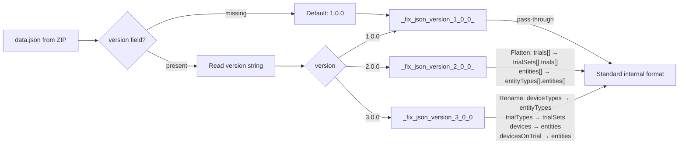
```mermaid
flowchart LR
    A[data.json from ZIP] --> B{version field?}
    B -->|missing| C["Default: 1.0.0"]
    B -->|present| D[Read version string]
    C --> E["_fix_json_version_1_0_0_"]
    D --> F{version}
    F -->|1.0.0| E
    F -->|2.0.0| G["_fix_json_version_2_0_0_"]
    F -->|3.0.0| H["_fix_json_version_3_0_0"]

    E -->|pass-through| I[Standard internal format]
    G -->|"Flatten: trials[] → trialSets[].trials[]<br>entities[] → entityTypes[].entities[]"| I
    H -->|"Rename: deviceTypes → entityTypes<br>trialTypes → trialSets<br>devices → entities<br>devicesOnTrial → entities"| I
```
-->

**Internal standard format** (what all versions are normalized to):

```json
{
    "experiment": {"name": "...", "description": "..."},
    "entityTypes": [
        {
            "name": "Sensor",
            "key": "...",
            "attributeTypes": [...],
            "entities": [{"name": "Sensor_01", "attributes": [...]}]
        }
    ],
    "trialSets": [
        {
            "name": "design",
            "attributeTypes": [...],
            "trials": [{"name": "trial1", "properties": [...], "entities": [...]}]
        }
    ],
    "maps": [...]
}
```

---

## Object Initialization Sequence

### Experiment Construction

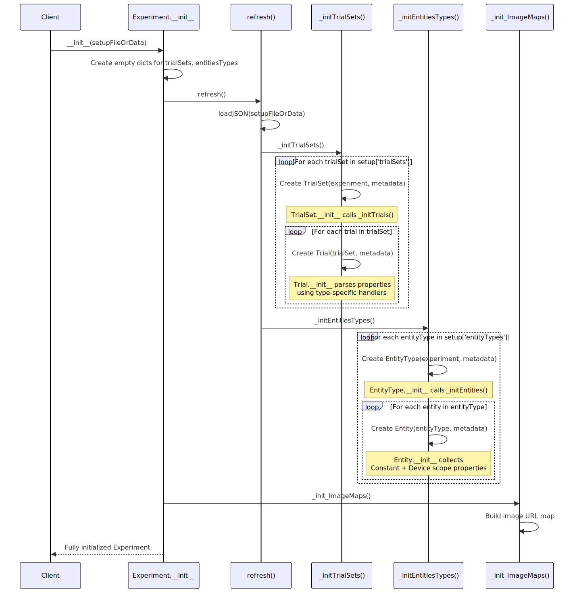

<!-- mermaid source (for editing, paste into mermaid.live):
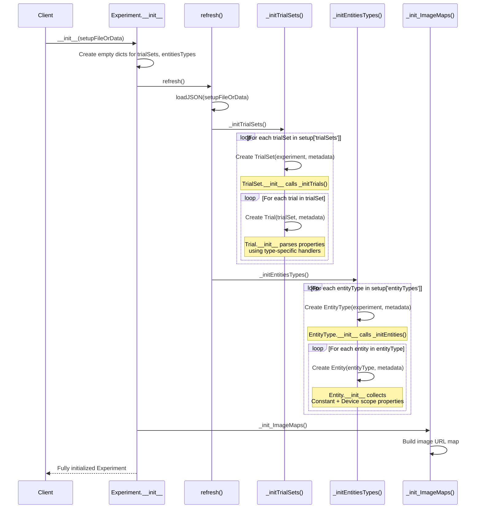
```mermaid
sequenceDiagram
    participant Client
    participant Exp as Experiment.__init__
    participant Refresh as refresh()
    participant TS as _initTrialSets()
    participant ET as _initEntitiesTypes()
    participant IMG as _init_ImageMaps()

    Client->>Exp: __init__(setupFileOrData)
    Exp->>Exp: Create empty dicts for trialSets, entitiesTypes
    Exp->>Refresh: refresh()
    Refresh->>Refresh: loadJSON(setupFileOrData)
    Refresh->>TS: _initTrialSets()

    loop For each trialSet in setup['trialSets']
        TS->>TS: Create TrialSet(experiment, metadata)
        Note over TS: TrialSet.__init__ calls _initTrials()
        loop For each trial in trialSet
            TS->>TS: Create Trial(trialSet, metadata)
            Note over TS: Trial.__init__ parses properties<br/>using type-specific handlers
        end
    end

    Refresh->>ET: _initEntitiesTypes()
    loop For each entityType in setup['entityTypes']
        ET->>ET: Create EntityType(experiment, metadata)
        Note over ET: EntityType.__init__ calls _initEntities()
        loop For each entity in entityType
            ET->>ET: Create Entity(entityType, metadata)
            Note over ET: Entity.__init__ collects<br/>Constant + Device scope properties
        end
    end

    Exp->>IMG: _init_ImageMaps()
    IMG->>IMG: Build image URL map
    Exp-->>Client: Fully initialized Experiment
```
-->

### Entity Property Collection

When an `Entity` is created, it collects properties from two sources:



<!-- mermaid source (for editing, paste into mermaid.live):
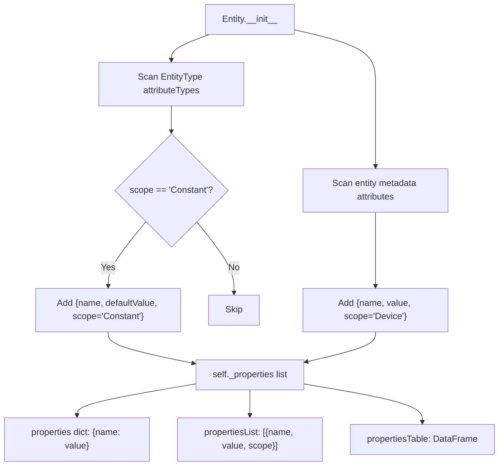
```mermaid
flowchart TD
    A[Entity.__init__] --> B[Scan EntityType attributeTypes]
    B --> C{scope == 'Constant'?}
    C -->|Yes| D["Add {name, defaultValue, scope='Constant'}"]
    C -->|No| E[Skip]

    A --> F[Scan entity metadata attributes]
    F --> G["Add {name, value, scope='Device'}"]

    D --> H[self._properties list]
    G --> H

    H --> I["properties dict: {name: value}"]
    H --> J["propertiesList: [{name, value, scope}]"]
    H --> K["propertiesTable: DataFrame"]
```
-->

---

## Property Type System

### Trial Property Parsing

When a `Trial` is initialized, each property value is parsed according to its type. The type is defined in the parent `TrialSet`'s `attributeTypes`:



<!-- mermaid source (for editing, paste into mermaid.live):
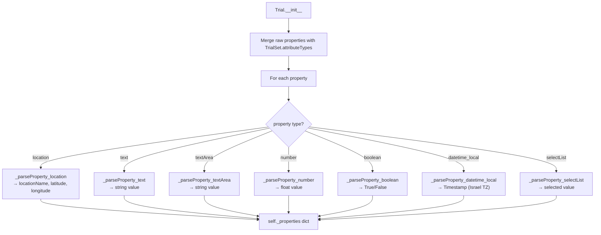
```mermaid
flowchart TD
    A[Trial.__init__] --> B[Merge raw properties with TrialSet.attributeTypes]
    B --> C[For each property]
    C --> D{property type?}

    D -->|location| E["_parseProperty_location<br/>→ locationName, latitude, longitude"]
    D -->|text| F["_parseProperty_text<br/>→ string value"]
    D -->|textArea| G["_parseProperty_textArea<br/>→ string value"]
    D -->|number| H["_parseProperty_number<br/>→ float value"]
    D -->|boolean| I["_parseProperty_boolean<br/>→ True/False"]
    D -->|datetime_local| J["_parseProperty_datetime_local<br/>→ Timestamp (Israel TZ)"]
    D -->|selectList| K["_parseProperty_selectList<br/>→ selected value"]

    E --> L["self._properties dict"]
    F --> L
    G --> L
    H --> L
    I --> L
    J --> L
    K --> L
```
-->

**Parser contract:** Every `_parseProperty_*` method returns `(columns: list[str], values: list)`. For most types this is a single column/value pair. For `location`, it expands to three columns.

### Property Scopes

Properties exist at different scopes throughout the hierarchy:



<!-- mermaid source (for editing, paste into mermaid.live):
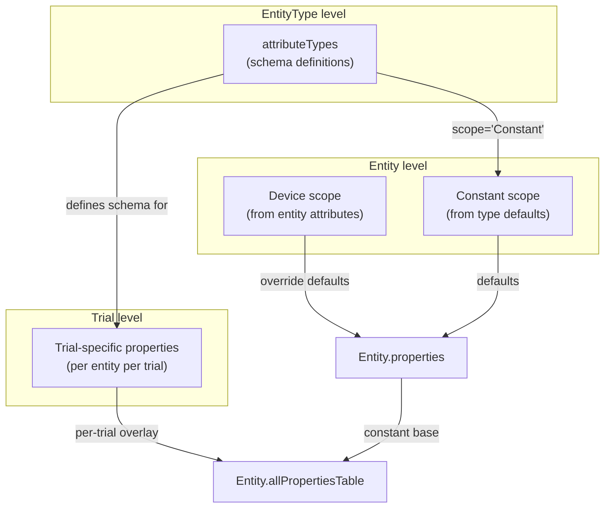
```mermaid
graph TD
    subgraph "EntityType level"
        A["attributeTypes<br/>(schema definitions)"]
    end

    subgraph "Entity level"
        B["Constant scope<br/>(from type defaults)"]
        C["Device scope<br/>(from entity attributes)"]
    end

    subgraph "Trial level"
        D["Trial-specific properties<br/>(per entity per trial)"]
    end

    A -->|"scope='Constant'"| B
    A -->|defines schema for| D
    C -->|"override defaults"| E[Entity.properties]
    B -->|"defaults"| E
    D -->|"per-trial overlay"| F[Entity.allPropertiesTable]
    E -->|"constant base"| F
```
-->

| Scope | Source | Changes per trial? | Access |
|-------|--------|--------------------|--------|
| **Constant** | EntityType `attributeTypes` with `scope='Constant'` | No | `entity.properties` |
| **Device** | Entity `attributes` in metadata | No | `entity.properties` |
| **Trial** | Trial `entities` data | Yes | `entity.trialProperties(setName, trialName)` |
| **All combined** | Constant + Device + Trial (forward-filled) | Yes | `entity.allPropertiesTable` |

---

## Containment Hierarchy Resolution

### The Problem

In ArgosWEB, entities can be "contained in" other entities (e.g., a sensor mounted on a pole, which is placed at a location). Child entities should inherit properties (especially `location`) from their parents.

### The Solution: `fillContained`



<!-- mermaid source (for editing, paste into mermaid.live):
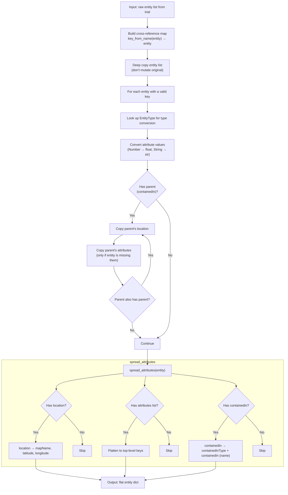
```mermaid
flowchart TD
    A["Input: raw entity list from trial"] --> B["Build cross-reference map<br/>key_from_name(entity) → entity"]

    B --> C["Deep copy entity list<br/>(don't mutate original)"]
    C --> D["For each entity with a valid key"]

    D --> E["Look up EntityType for type conversion"]
    E --> F["Convert attribute values<br/>(Number → float, String → str)"]

    F --> G{"Has parent<br/>(containedIn)?"}
    G -->|Yes| H["Copy parent's location"]
    H --> I["Copy parent's attributes<br/>(only if entity is missing them)"]
    I --> J{"Parent also has parent?"}
    J -->|Yes| H
    J -->|No| K[Continue]
    G -->|No| K

    K --> L["spread_attributes(entity)"]

    subgraph "spread_attributes"
        L --> M{"Has location?"}
        M -->|Yes| N["location → mapName, latitude, longitude"]
        M -->|No| O[Skip]

        L --> P{"Has attributes list?"}
        P -->|Yes| Q["Flatten to top-level keys"]
        P -->|No| R[Skip]

        L --> S{"Has containedIn?"}
        S -->|Yes| T["containedIn → containedInType + containedIn (name)"]
        S -->|No| U[Skip]
    end

    N --> V["Output: flat entity dict"]
    Q --> V
    T --> V
```
-->

### Walk Example

Consider this containment chain:

```
Location_A (has location: {name: "Field", coordinates: [34.8, 32.0]})
  └── Pole_01 (contained in Location_A, has attribute: height=3.0)
        └── Sensor_01 (contained in Pole_01, has attribute: threshold=25.0)
```

After `fill_properties_by_contained`:

```python
# Sensor_01 gets:
{
    "deviceItemName": "Sensor_01",
    "deviceTypeName": "Sensor",
    "threshold": 25.0,       # own attribute
    "height": 3.0,           # inherited from Pole_01
    "mapName": "Field",       # inherited from Location_A (via location)
    "latitude": 32.0,         # inherited from Location_A
    "longitude": 34.8,        # inherited from Location_A
    "containedInType": "Pole",
    "containedIn": "Pole_01"
}
```

---

## Pandas DataFrame Interface

### DataFrame Generation Map

Every major object exposes one or more DataFrame properties. This diagram shows how they are computed:



<!-- mermaid source (for editing, paste into mermaid.live):

```mermaid
flowchart TD
    subgraph "Experiment level"
        A["experiment.entitiesTable"] --> A1["Loop entityType → entity<br/>Concat propertiesTable + entityType + entityName"]
        B["experiment.entityTypeTable"] --> B1["Loop entityType<br/>Concat propertiesTable + entityType"]
        C["experiment.trialsTableAllSets"] --> C1["Loop trialSet → trialsTable<br/>Concat + add trialSet column"]
    end

    subgraph "TrialSet level"
        D["trialSet.propertiesTable"] --> D1["DataFrame(attributeTypes)"]
        E["trialSet.trialsTable"] --> E1["DataFrame(toJSON()['trials']).T"]
    end

    subgraph "Trial level"
        F["trial.propertiesTable"] --> F1["DataFrame(properties, index=[0])"]
        G["trial.entitiesTable"] --> G1["fill_properties_by_contained<br/>→ _composeProperties"]
        H["trial.entities"] --> H1["entitiesTable → set_index → T.to_dict<br/>→ filter out NaN"]
    end

    subgraph "EntityType level"
        I["entityType.propertiesTable"] --> I1["DataFrame(attributeTypes)"]
        J["entityType.entitiesTable"] --> J1["Loop entity → propertiesTable<br/>Concat + set_index(entityName)"]
        K["entityType.entitiesAllProperties"] --> K1["Loop entity → allPropertiesTable<br/>Concat + set_index(entityName, trialName)"]
    end

    subgraph "Entity level"
        L["entity.propertiesTable"] --> L1["DataFrame(propertiesList)"]
        M["entity.allTrialPropertiesTable"] --> M1["Loop trialSet → trial<br/>trialProperties() + trialSetName + trialName"]
        N["entity.allPropertiesTable"] --> N1["allTrialPropertiesTable.join(propertiesTable)<br/>.ffill()"]
    end
```
-->

### Relationship Between DataFrames



<!-- mermaid source (for editing, paste into mermaid.live):
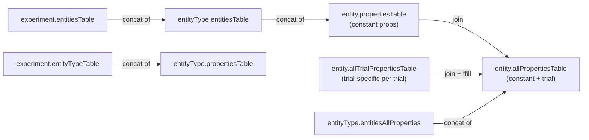
```mermaid
graph LR
    A["entity.propertiesTable<br/>(constant props)"] -->|join| C["entity.allPropertiesTable<br/>(constant + trial)"]
    B["entity.allTrialPropertiesTable<br/>(trial-specific per trial)"] -->|join + ffill| C

    D["entityType.entitiesTable"] -->|"concat of"| A
    E["entityType.entitiesAllProperties"] -->|"concat of"| C

    F["experiment.entitiesTable"] -->|"concat of"| D
    G["experiment.entityTypeTable"] -->|"concat of"| H["entityType.propertiesTable"]
```
-->

---

## Serialization (toJSON)

Each object can be serialized back to a JSON-compatible dict. The serialization is hierarchical:



<!-- mermaid source (for editing, paste into mermaid.live):
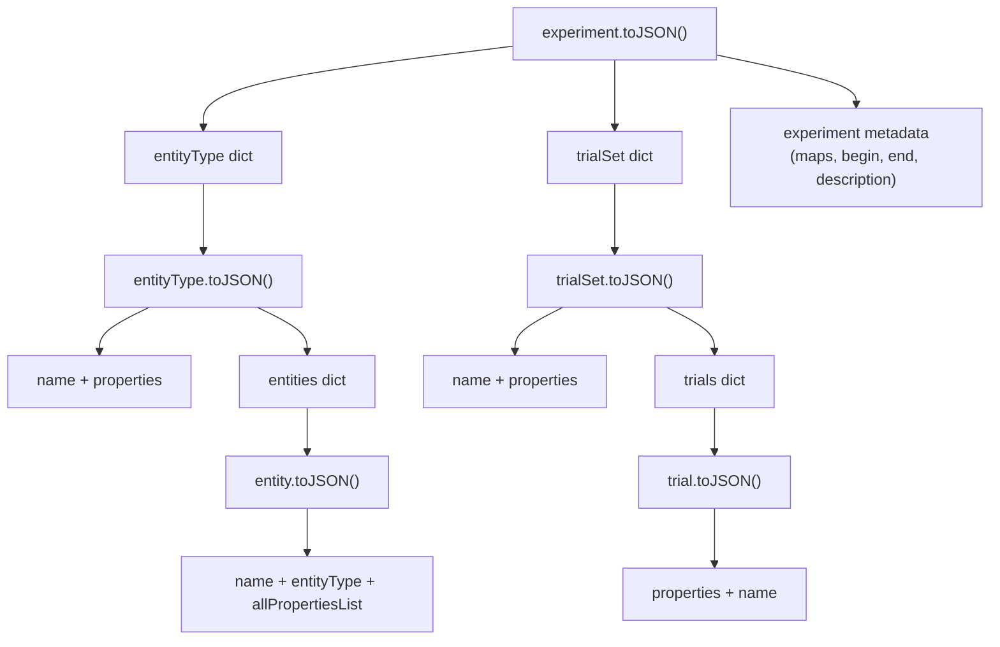
```mermaid
flowchart TD
    A["experiment.toJSON()"] --> B["entityType dict"]
    A --> C["trialSet dict"]
    A --> D["experiment metadata<br/>(maps, begin, end, description)"]

    B --> E["entityType.toJSON()"]
    E --> F["name + properties"]
    E --> G["entities dict"]
    G --> H["entity.toJSON()"]
    H --> I["name + entityType + allPropertiesList"]

    C --> J["trialSet.toJSON()"]
    J --> K["name + properties"]
    J --> L["trials dict"]
    L --> M["trial.toJSON()"]
    M --> N["properties + name"]
```
-->

---

## Deprecated Interface

Several methods and properties are deprecated but maintained for backwards compatibility. They all emit `DeprecationWarning` and delegate to current methods:

| Deprecated | Replacement | Class |
|-----------|-------------|-------|
| `trial.deployEntitiesTable` | `trial.entitiesTable` | Trial |
| `trial.designEntities` | `trial.entities` | Trial |
| `trial.designEntitiesTable` | `trial.entitiesTable` | Trial |
| `trial.deployEntities` | `trial.entities` | Trial |
| `entity.trial(set, name, state)` | `entity.trialProperties(set, name)` | Entity |
| `entity.designProperties` | `entity.allTrialProperties` | Entity |
| `entity.deployProperties` | `entity.allTrialProperties` | Entity |
| `entity.trialDesign(set, name)` | `entity.trialProperties(set, name)` | Entity |
| `entity.trialDeploy(set, name)` | `entity.trialProperties(set, name)` | Entity |

!!! warning "Migration"
    If you see `DeprecationWarning` from pyArgos, update your code to use the replacement methods. The deprecated methods may be removed in a future version.

---

## Design Decisions

### Why `dict` subclasses for TrialSet and EntityType?

TrialSet and EntityType extend `dict` rather than using a plain attribute. This enables natural Python dictionary syntax for accessing children while still providing rich properties:

```python
# Natural dict access
trial = experiment.trialSet["design"]["morning"]
entity = experiment.entityType["Sensor"]["Sensor_01"]

# But also rich properties
experiment.trialSet["design"].trialsTable    # DataFrame
experiment.entityType["Sensor"].entitiesTable  # DataFrame
```

### Why Pandas for everything?

Experiment metadata is inherently tabular (entities have rows of properties, trials have rows of attributes). Pandas provides:

- Filtering: `df[df.entityType == "Sensor"]`
- Joining: merge entity data with trial data
- Export: `to_csv()`, `to_parquet()`, `to_json()`
- Familiar API for data scientists working with pyArgos

### Why factory pattern?

The same `Experiment` interface is needed regardless of whether data comes from a local file, a ZIP archive, or a remote server. The factory pattern:

- Hides the complexity of source detection (ZIP vs JSON vs GraphQL)
- Handles version migration transparently
- Returns a uniform interface that client code can rely on
