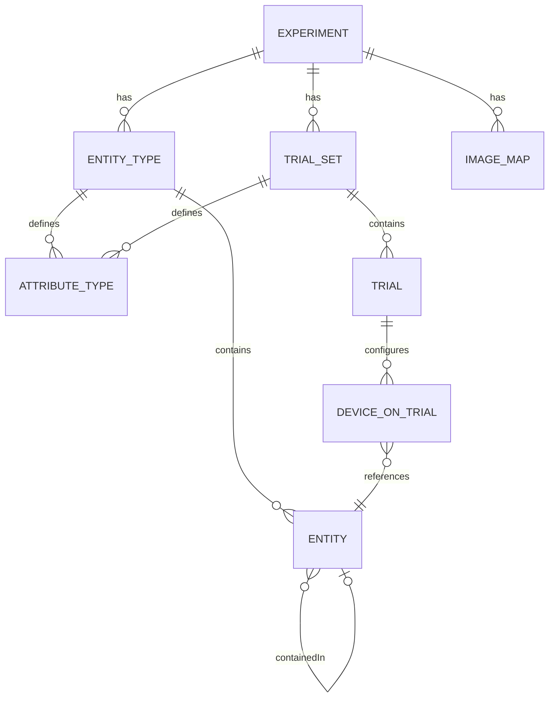
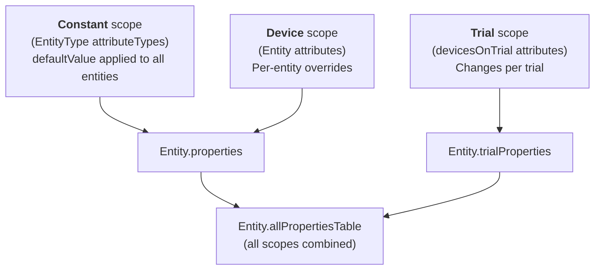
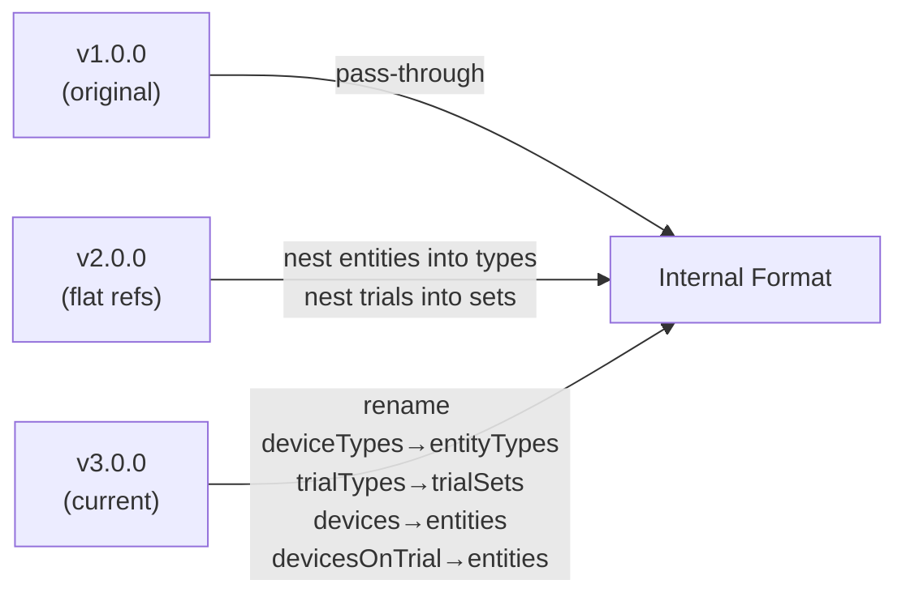

# Data Model Reference

This page documents the domain model of pyArgos -- what experiments, trials, and entities are, how they relate to each other, and the exact JSON and ZIP file formats used to store them.

---

## Domain Concepts

### What is an Experiment?

An **Experiment** is a complete scientific or engineering study conducted with IoT devices. It defines:

- **What devices** are used (entity types and entities)
- **What configurations** are tested (trial sets and trials)
- **Where things are** (image maps with geo-coordinates)
- **When it runs** (start and end dates)

An experiment is created in [ArgosWEB](https://github.com/argosp) and exported as a ZIP file, or loaded directly from the server via GraphQL.

### What is an Entity Type?

An **Entity Type** (called `deviceType` in the JSON) defines a **category** of devices or assets. For example: `"Sensor"`, `"WeatherStation"`, `"Gateway"`.

Each entity type defines:

- **Attribute types** -- the schema of properties that entities of this type can have (name, type, scope, default value)
- **Entities** -- the individual device/asset instances of this type

Think of it as a **class definition** for devices.

### What is an Entity?

An **Entity** (called `device` in the JSON) is a **single instance** of an entity type. For example: `"Sensor_01"`, `"Sensor_02"`.

Entities have:

- A **name** (unique within their type)
- **Attributes** that override or extend the type-level defaults
- Optionally, a **containedIn** relationship to a parent entity (e.g., a sensor mounted on a pole)

Think of it as an **object instance** of the device class.

### What is a Trial Set?

A **Trial Set** (called `trialType` in the JSON) groups related trials together. Common examples:

- `"design"` -- planned configurations before deployment
- `"deploy"` -- active configurations sent to devices

Each trial set defines:

- **Attribute types** -- the schema of trial-level properties (e.g., `TrialStart`, `TrialEnd`)
- **Trials** -- the individual configurations within this set

### What is a Trial?

A **Trial** is a **specific experimental configuration** -- a snapshot that assigns attributes to entities. For example, a "morning" trial might place sensors at certain locations with specific thresholds, while a "night" trial uses different positions.

Trials contain:

- **Trial-level properties** (e.g., start date, end date)
- **Devices on trial** -- a list of entities with their trial-specific attributes (location, calibration values, etc.)

### How They Relate



<!-- mermaid source (for editing, paste into mermaid.live):

-->

---

## ZIP File Format

Experiments exported from ArgosWEB are packaged as `.zip` archives. pyArgos looks for these in the `runtimeExperimentData/` directory.

### Archive Contents

```
experiment_<name>.zip
  ├── data.json         # The experiment definition (required)
  ├── shapes.geojson    # GeoJSON shapes for map overlays (optional)
  └── images/           # Map images for spatial visualization (optional)
        ├── fieldMap.png
        └── siteOverview.png
```

| File | Required | Description |
|------|----------|-------------|
| `data.json` | Yes | The complete experiment definition (entities, trials, maps) |
| `shapes.geojson` | No | GeoJSON features for geographic overlays |
| `images/*.png` | No | Map images referenced by `imageStandalone` entries in `data.json` |

---

## JSON Schema: Version 3.0.0 (Current)

This is the current format exported by ArgosWEB. pyArgos normalizes all versions to an internal format based on this structure.

### Top-Level Structure

```json
{
    "version": "3.0.0",
    "name": "My Experiment",
    "description": "...",
    "startDate": "2024-01-01T00:00:00.000Z",
    "endDate": "2024-12-31T00:00:00.000Z",
    "deviceTypes": [ ... ],
    "trialTypes": [ ... ],
    "imageStandalone": [ ... ],
    "imageEmbedded": [ ... ],
    "shapes": [ ... ]
}
```

| Field | Type | Description |
|-------|------|-------------|
| `version` | string | Schema version (`"3.0.0"`) |
| `name` | string | Experiment name |
| `description` | string | Human-readable description |
| `startDate` | string | ISO 8601 start date |
| `endDate` | string | ISO 8601 end date |
| `deviceTypes` | array | Entity type definitions (see below) |
| `trialTypes` | array | Trial set definitions (see below) |
| `imageStandalone` | array | Map image definitions with bounding coordinates |
| `imageEmbedded` | array | Embedded image data |
| `shapes` | array | GeoJSON-like shape definitions |

### Device Type (Entity Type)

```json
{
    "name": "Sensor",
    "attributeTypes": [
        {
            "name": "StoreDataPerDevice",
            "type": "Boolean",
            "defaultValue": false,
            "scope": "Constant"
        },
        {
            "name": "threshold",
            "type": "Number"
        },
        {
            "name": "location",
            "type": "location"
        }
    ],
    "devices": [
        { "name": "Sensor_01" },
        { "name": "Sensor_02" }
    ]
}
```

| Field | Type | Description |
|-------|------|-------------|
| `name` | string | The type name (e.g., `"Sensor"`) |
| `attributeTypes` | array | Property schema definitions |
| `attributeTypes[].name` | string | Property name |
| `attributeTypes[].type` | string | Property type (see [Property Types](#property-types)) |
| `attributeTypes[].defaultValue` | any | Default value for Constant-scope properties |
| `attributeTypes[].scope` | string | `"Constant"` for type-level defaults, omitted for trial-level |
| `devices` | array | Entity instances |
| `devices[].name` | string | Entity name (unique within type) |

### Trial Type (Trial Set)

```json
{
    "name": "design",
    "attributeTypes": [
        { "type": "Date", "name": "TrialStart" },
        { "type": "Date", "name": "TrialEnd" }
    ],
    "trials": [
        {
            "name": "morning",
            "createdDate": "2024-01-15T10:00:00.000Z",
            "devicesOnTrial": [ ... ]
        }
    ]
}
```

| Field | Type | Description |
|-------|------|-------------|
| `name` | string | Trial set name |
| `attributeTypes` | array | Trial-level property schema |
| `trials` | array | Individual trials |
| `trials[].name` | string | Trial name |
| `trials[].createdDate` | string | ISO 8601 creation timestamp |
| `trials[].devicesOnTrial` | array | Per-entity trial data |

### Device on Trial (Trial Entity Data)

This is the core of the trial -- it maps entities to their trial-specific attributes:

```json
{
    "deviceTypeName": "Sensor",
    "deviceItemName": "Sensor_01",
    "location": {
        "name": "OSMMap",
        "coordinates": [32.08, 34.94]
    },
    "attributes": [
        { "name": "threshold", "value": "25.0" },
        { "name": "calibration", "value": "1.05" }
    ],
    "containedIn": {
        "deviceTypeName": "Pole",
        "deviceItemName": "Pole_01"
    }
}
```

| Field | Type | Description |
|-------|------|-------------|
| `deviceTypeName` | string | The entity type name |
| `deviceItemName` | string | The entity name |
| `location` | object | Geo-location with `name` (map name) and `coordinates` [lat, lon] |
| `attributes` | array | Trial-specific property values as `{name, value}` pairs |
| `containedIn` | object | Parent entity reference (for containment hierarchy) |

!!! note "Containment"
    When `containedIn` is set, pyArgos walks the parent chain and inherits missing attributes and the location from parent entities. See [Containment Resolution](architecture/experiment_setup.md#containment-hierarchy-resolution) for details.

### Image Maps

```json
{
    "name": "FieldMap",
    "imageUrl": "images/fieldMap.png",
    "lower": 32.0,
    "upper": 32.2,
    "left": 34.8,
    "right": 35.0,
    "width": 1024,
    "height": 768,
    "embedded": false
}
```

| Field | Type | Description |
|-------|------|-------------|
| `name` | string | Image identifier |
| `imageUrl` | string | Path to the image file (relative to ZIP root or server URL) |
| `lower`, `upper` | float | Latitude bounds |
| `left`, `right` | float | Longitude bounds |
| `width`, `height` | int | Image dimensions in pixels |
| `embedded` | bool | Whether the image data is embedded in the JSON |

---

## Property Types

Properties (attributes) in pyArgos are typed. The type is defined in the `attributeTypes` schema and determines how values are parsed:

| Type | JSON Value | Parsed Python Value | Notes |
|------|-----------|---------------------|-------|
| `Boolean` | `"true"`, `"false"` | `bool` | Case-insensitive, also accepts `"yes"`/`"no"`, `"1"`/`"0"` |
| `Number` | `"25.0"` | `float` | Always stored as string in JSON, parsed to float |
| `String` | `"abc"` | `str` | Pass-through |
| `text` | `"abc"` | `str` | Same as String (trial-level) |
| `textArea` | `"long text..."` | `str` | Multi-line text |
| `Date` | `"2024-01-15T10:00:00.000Z"` | `str` | ISO 8601 (not parsed to datetime at type level) |
| `datetime_local` | `"2024-01-15T10:00:00"` | `pandas.Timestamp` | Parsed with Israel timezone |
| `location` | `{"name": "...", "coordinates": [...]}` | 3 columns: `locationName`, `latitude`, `longitude` | Expanded when parsed |
| `selectList` | `"optionA"` | `str` | Value from a predefined list |

!!! info "String encoding"
    All property values in `devicesOnTrial` are stored as **strings** in the JSON, regardless of their declared type. pyArgos parses them to the appropriate Python type based on the `attributeTypes` schema.

---

## Property Scopes

Properties exist at different levels in the hierarchy:



<!-- mermaid source (for editing, paste into mermaid.live):

-->

| Scope | Defined in | Changes per trial? | Example |
|-------|-----------|-------------------|---------|
| **Constant** | `attributeTypes` with `scope: "Constant"` | No | `StoreDataPerDevice: false` |
| **Device** | Entity `attributes` in metadata | No | (entity-level overrides) |
| **Trial** | `devicesOnTrial[].attributes` | Yes | `threshold: 25.0`, `location: {...}` |

---

## JSON Schema: Version 2.0.0

Version 2.0.0 uses a flatter structure where trials and entities are at the top level rather than nested inside their parent sets/types.

### Top-Level Structure

```json
{
    "version": "2.0.0.",
    "experiment": { "name": "...", "description": "..." },
    "entityTypes": [
        { "key": "...", "name": "Sensor", "attributeTypes": [...] }
    ],
    "entities": [
        { "key": "...", "name": "Sensor_01", "entitiesTypeKey": "..." }
    ],
    "trialSets": [
        { "key": "...", "name": "design", "attributeTypes": [...] }
    ],
    "trials": [
        { "key": "...", "name": "morning", "trialSetKey": "...", "entities": [...] }
    ]
}
```

**Key differences from 3.0.0:**

- Entities and trials are **top-level arrays** linked by `key`/`entitiesTypeKey`/`trialSetKey`
- Uses `entityTypes`/`entities` instead of `deviceTypes`/`devices`
- Uses `trialSets`/`trials` instead of `trialTypes` with nested trials
- All objects have a `key` field for cross-referencing

pyArgos migrates this to the internal format by:

1. Nesting `entities` into their parent `entityTypes` (matched by `entitiesTypeKey`)
2. Nesting `trials` into their parent `trialSets` (matched by `trialSetKey`)

---

## JSON Schema: Version 1.0.0

Version 1.0.0 is the oldest format. It uses the same structure as the pyArgos internal format (no migration needed).

The structure matches version 2.0.0's `entityTypes`/`trialSets` with nested entities/trials -- it's essentially a pass-through.

---

## Version Migration Summary



<!-- mermaid source (for editing, paste into mermaid.live):

-->

The internal format that all versions are normalized to:

```json
{
    "experiment": { "name": "...", "description": "..." },
    "entityTypes": [
        {
            "name": "...",
            "attributeTypes": [...],
            "entities": [...]
        }
    ],
    "trialSets": [
        {
            "name": "...",
            "attributeTypes": [...],
            "trials": [
                {
                    "name": "...",
                    "properties": [...],
                    "entities": [...]
                }
            ]
        }
    ],
    "maps": [...]
}
```

---

## Experiment Directory Structure

On disk, a pyArgos experiment follows this layout:

```
MyExperiment/
  code/                                 # Analysis scripts
    argos_basic.py                      # Auto-generated experiment loader
  data/                                 # Parquet data files (from Kafka consumers)
    Sensor.parquet
    Gateway.parquet
  runtimeExperimentData/                # Configuration and metadata
    Datasources_Configurations.json     # Main config (Kafka, ThingsBoard)
    experiment_MyExperiment.zip         # Experiment definition from ArgosWEB
    deviceMap.json                      # Node-RED device mapping (auto-generated)
    trials/
      trialTemplate.json                # Generated template
      design/
        morningTrial.json               # Trial design files
```

### Datasources_Configurations.json

The main runtime configuration file:

```json
{
    "experimentName": "MyExperiment",
    "kafka": {
        "bootstrap_servers": ["127.0.0.1:9092"]
    },
    "Thingsboard": {
        "restURL": "http://localhost:8080",
        "username": "tenant@thingsboard.org",
        "password": "tenant"
    }
}
```

See [Configuration Reference](../user_guide/configuration.md) for full details.
