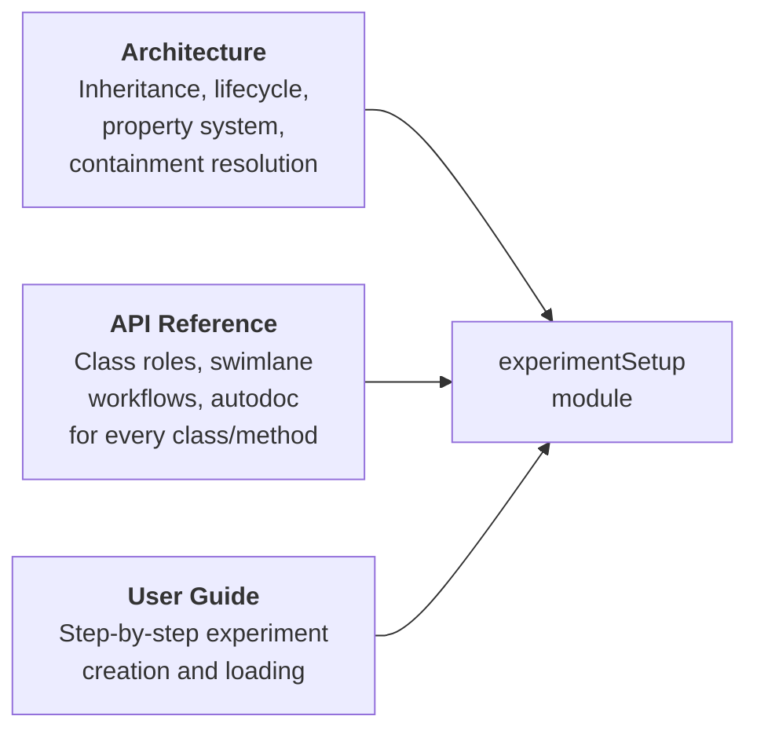

# Experiment Setup

The `argos.experimentSetup` module is the core of pyArgos. It handles loading experiment definitions, parsing them into a typed object hierarchy, and exposing the data as Pandas DataFrames.

This section collects all developer documentation for this module in one place.

---

## Documentation Map

---

## Architecture

The architecture page covers the **internal design** of the module: how classes inherit from each other, how objects are constructed, how properties flow through the system, and why key design decisions were made.

- [**Experiment Setup Architecture**](architecture/experiment_setup.md)
    - Module overview and file layout
    - Inheritance hierarchy (Experiment → ExperimentZipFile / webExperiment)
    - Container classes (dict-based TrialSet, EntityType)
    - Full object composition diagram
    - Factory pattern decision flow
    - Version migration detail (1.0.0 → 2.0.0 → 3.0.0)
    - Object initialization sequence
    - Entity property collection (Constant / Device / Trial scopes)
    - Trial property type system (location, text, number, boolean, datetime, selectList)
    - Containment hierarchy resolution with walkthrough example
    - Pandas DataFrame generation map
    - Serialization (toJSON) hierarchy
    - Deprecated interface migration table
    - Design decisions (why dict subclasses, why Pandas, why factories)

---

## API Reference

The API page provides the **class-level documentation** with role descriptions, call workflow diagrams, and auto-generated docs from source docstrings.

- [**Experiment Setup API**](api/experiment_setup.md)
    - Class roles summary table
    - Inheritance and container hierarchy diagrams
    - Swimlane: loading experiment from file
    - Swimlane: loading experiment from web (GraphQL)
    - Swimlane: accessing trial entity data (containment resolution)
    - Auto-generated docs for every class and method:
        - `getExperimentSetup` (module entry point)
        - `fileExperimentFactory`, `webExperimentFactory`
        - `Experiment`, `ExperimentZipFile`, `webExperiment`
        - `TrialSet`, `Trial`
        - `EntityType`, `Entity`
        - `fill_properties_by_contained`, `spread_attributes`, `get_parent`, `key_from_name`

---

## User Guide

The user guide covers the **practical usage** -- how to create experiments, define entities, configure trials, and load data in Python.

- [**Experiment Setup (User Guide)**](../user_guide/experiment_setup.md)
    - Creating an experiment directory
    - Configuring datasources
    - Defining entities (DEVICE / ASSET)
    - Setting up trials (template → design → upload)
    - Loading experiments in Python (file and web)

---

## Quick Navigation

| I want to... | Go to |
|--------------|-------|
| Understand the class hierarchy and design | [Architecture](architecture/experiment_setup.md) |
| Look up a specific method or property | [API Reference](api/experiment_setup.md) |
| See how data flows through the system | [Architecture → Data Flow](architecture/data_flow.md) |
| Create and configure an experiment | [User Guide](../user_guide/experiment_setup.md) |
| Understand how containment works | [Architecture → Containment](architecture/experiment_setup.md#containment-hierarchy-resolution) |
| See all DataFrame properties | [Architecture → DataFrame Map](architecture/experiment_setup.md#pandas-dataframe-interface) |
| Understand version migrations | [Architecture → Version Migration](architecture/experiment_setup.md#version-migration-detail) |
