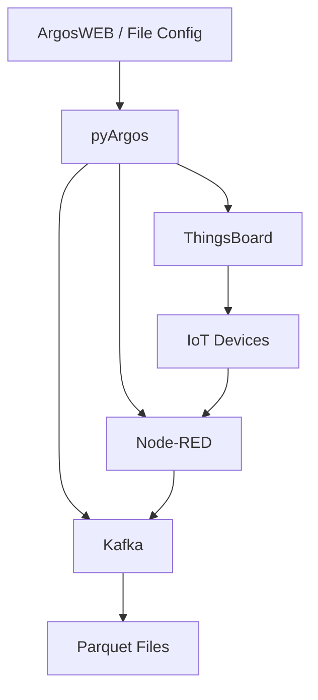

# pyArgos

**Python wrappings for the Argos IoT experiment management platform**

---

## What is pyArgos?

pyArgos is a Python toolkit for managing IoT experiments end-to-end. It provides a unified interface for experiment configuration, device management via ThingsBoard, real-time data streaming via Kafka, and data storage in Parquet format.

```python
from argos.experimentSetup import fileExperimentFactory

# Load an experiment from local files
experiment = fileExperimentFactory("/path/to/experiment").getExperiment()

# Access entities and trials
print(experiment.entitiesTable)
print(experiment.trialSet["design"]["myTrial"].entitiesTable())
```

---

## High-Level Architecture



<!-- mermaid source (for editing, paste into mermaid.live):

-->

---

## Documentation Sections

| Section | Description |
|---------|-------------|
| [**User Guide**](user_guide/index.md) | Installation, configuration, experiment setup, and CLI usage |
| [**Developer Guide**](developer_guide/index.md) | Architecture, API reference, data flow, and module internals |

---

## Key Features

| Feature | Description |
|---------|-------------|
| **Experiment Management** | Create, configure, and run IoT experiments from file or web |
| **ThingsBoard Integration** | Manage devices, assets, and attributes via REST API |
| **Kafka Streaming** | Consume device data topics and write to Parquet |
| **Node-RED Support** | Device mapping and flow management |
| **NoSQL Support** | Query Cassandra and MongoDB via Dask for parallel processing |
| **Data Processing** | JSON to Pandas conversion, Parquet I/O with partitioning |

---

## Project Structure

```
pyargos/
  argos/
    __init__.py             # Package entry point (v1.2.3)
    CLI.py                  # Command-line interface
    manager.py              # Experiment manager + ThingsBoard interface
    experimentSetup/        # Experiment data objects and factory pattern
    kafka/                  # Kafka consumer for data ingestion
    thingsboard/            # ThingsBoard mock devices
    nodered/                # Node-RED integration and custom nodes
    noSQLdask/              # Cassandra and MongoDB via Dask
    utils/                  # Logging, JSON, and Parquet utilities
    examples/               # Example configurations
```
