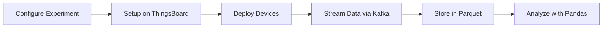

# Key Concepts

Understanding the core concepts behind pyArgos will help you work with the platform effectively.

---

## The Big Picture

pyArgos manages IoT experiments through a hierarchy of objects that mirror how experiments are organized in the real world:

```
Experiment
  ├── EntityType (e.g., "Sensor", "Controller")
  │     └── Entity (e.g., "Sensor_01", "Sensor_02")
  │           └── Properties (attributes, credentials)
  │
  └── TrialSet (e.g., "design", "deploy")
        └── Trial (e.g., "trial_morning", "trial_night")
              └── Entity data (per-trial attributes for each entity)
```

---

## Experiments

An **Experiment** is the top-level container. It defines:

- The **entity types** (types of devices/assets) involved
- The **entities** (individual devices/assets) and their properties
- The **trial sets** and **trials** that configure behavior over time
- Optional **image maps** for spatial visualization

Experiments can be loaded from two sources:

| Source | Factory | Description |
|--------|---------|-------------|
| **File** | `fileExperimentFactory` | Loads from a local directory or ZIP file |
| **Web** | `webExperimentFactory` | Fetches from ArgosWEB via GraphQL |

```python
from argos.experimentSetup import fileExperimentFactory

experiment = fileExperimentFactory("/path/to/experiment").getExperiment()
```

---

## Entities and Entity Types

An **EntityType** defines a category of devices or assets (e.g., "Sensor", "WeatherStation"). Each type has:

- A set of **properties** (attribute definitions)
- A collection of **entities** (individual instances)

An **Entity** is a single device or asset. Entities have:

- A **name** (e.g., `Sensor_01`)
- An **entityType** (`"DEVICE"` or `"ASSET"`)
- **Properties** that are constant across trials
- **Trial-specific properties** that change per trial

```python
# Access all entities as a DataFrame
experiment.entitiesTable

# Access entities of a specific type
experiment.entityType["Sensor"].entitiesTable
```

---

## Trial Sets and Trials

A **TrialSet** groups related trials together (e.g., "design" for planned trials, "deploy" for active ones).

A **Trial** represents a specific experimental configuration. It maps entities to their trial-specific attributes (e.g., sensor locations, thresholds, calibration values).

```python
# Access a specific trial
trial = experiment.trialSet["design"]["myTrial"]

# Get entity data for the trial as a dict
trial.entitiesTable()

# Get trial properties
trial.propertiesTable
```

---

## Data Flow

The typical data flow in a pyArgos experiment:



1. **Configure** - Define entities and trials in JSON or via ArgosWEB
2. **Setup** - Upload device profiles and entities to ThingsBoard
3. **Deploy** - Load trial attributes to devices
4. **Stream** - Consume device data from Kafka topics
5. **Store** - Write data to Parquet files (partitioned by time)
6. **Analyze** - Load Parquet files into Pandas DataFrames

---

## Experiment Directory Structure

Every pyArgos experiment follows a standard directory layout:

```
MyExperiment/
  code/                         # Analysis scripts
    argos_basic.py              # Auto-generated experiment loader
  data/                         # Parquet data files (one per device type)
  runtimeExperimentData/        # Configuration and metadata
    Datasources_Configurations.json   # Main config (Kafka, ThingsBoard)
    deviceMap.json              # Node-RED device mapping
    <experimentName>.zip        # Experiment definition (from ArgosWEB)
    trials/
      design/                   # Trial design files
        myTrial.json
      trialTemplate.json        # Generated template
```
