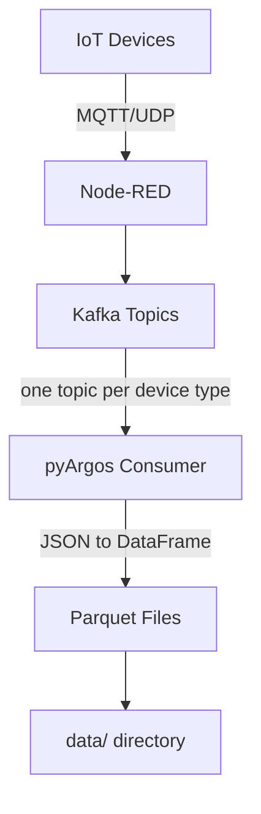

# Kafka Integration

pyArgos uses Apache Kafka for streaming data from IoT devices to Parquet storage.

---

## Prerequisites

### Install Kafka and Zookeeper

Follow the [Apache Kafka quickstart](https://kafka.apache.org/quickstart) to install and start Kafka with Zookeeper.

### Install ksqlDB (optional)

[ksqlDB](https://docs.ksqldb.io/en/latest/operate-and-deploy/installation/installing/) provides SQL-like stream processing:

```bash
docker pull confluentinc/ksqldb-server
docker pull confluentinc/ksqldb-cli  # optional
```

---

## Verifying the Installation

### Create the management topic

```bash
<path-to-confluent>/bin/kafka-topics.sh \
    --create --topic argosManagement \
    --bootstrap-server 127.0.0.1:9092
```

### List topics

```bash
<path-to-confluent>/bin/kafka-topics.sh \
    --list --bootstrap-server 127.0.0.1:9092
```

### Send messages

```bash
# Interactive
<path-to-confluent>/bin/kafka-console-producer.sh \
    --bootstrap-server localhost:9092 --topic argosManagement

# From file
<path-to-confluent>/bin/kafka-console-producer.sh \
    --bootstrap-server localhost:9092 --topic argosManagement < inFile
```

### Receive messages

```bash
<path-to-confluent>/bin/kafka-console-consumer.sh \
    --bootstrap-server localhost:9092 --topic argosManagement
```

---

## Using Kafka with pyArgos

### Creating Topics

pyArgos creates one Kafka topic per entity type, plus a `kafkaConsumerServer` management topic:

```bash
python -m argos.bin.trialManager --kafkaCreateTopics
```

!!! note
    This reads the experiment configuration from the current directory's `runtimeExperimentData/Datasources_Configurations.json`.

### Consuming Data

#### Single topic

```bash
python -m argos.bin.trialManager --kafkaRunConsumerTopic <topic-name>
```

Consumes all messages from the topic and writes them to `data/<topic-name>.parquet`.

#### All topics (multi-threaded)

```bash
python -m argos.bin.trialManager --kafkaRunConsumers
```

Starts one consumer thread per device type. Automatically creates topics if they don't exist.

#### Server mode (continuous)

```bash
python -m argos.bin.trialManager --kafkaRunConsumersServer --delay 5min
```

Runs consumers in an infinite loop, polling periodically. The `delay` parameter accepts pandas timedelta strings (e.g., `5min`, `30s`, `1h`).

---

## Data Pipeline



<!-- mermaid source (for editing, paste into mermaid.live):

-->

### What happens during consumption

1. **Poll** - Consumer reads batches of up to 5000 messages
2. **Parse** - JSON messages are converted to a Pandas DataFrame
3. **Transform** - Timezone conversion (Israel) and numeric type casting
4. **Deduplicate** - Duplicate timestamps are removed
5. **Store** - Data is appended to the Parquet file for that topic

### Consumer Configuration

Consumer behavior can be customized via `consumersConf.json`:

```json
{
    "Sensor": {
        "slideWindow": "60",
        "processesConfig": {
            "None": {
                "argos.kafka.processes.to_parquet_CampbellBinary": {}
            },
            "180": {
                "argos.kafka.processes.calc_wind": {}
            }
        }
    }
}
```
