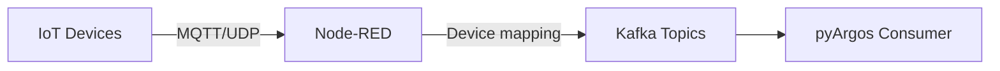

# Node-RED Integration

pyArgos provides tools for integrating with [Node-RED](https://nodered.org/), a flow-based programming tool commonly used in IoT applications.

---

## Overview

Node-RED sits between IoT devices and Kafka in the data pipeline:



pyArgos provides:

- **Device map generation** - Maps device names to types for Node-RED routing
- **Custom Node-RED nodes** - Parquet export and ThingsBoard integration nodes
- **Flow management** - REST interface to the Node-RED server

---

## Device Map

The device map translates device identifiers into their types, allowing Node-RED to route messages to the correct Kafka topic.

### Generate the device map

```bash
cd /path/to/experiment
python -m argos.bin.trialManager --noderedCreateDeviceMap
```

This creates `runtimeExperimentData/deviceMap.json`:

```json
{
    "Sensor 1": {"entityType": "DEVICE", "entityName": "Sensor_0001"},
    "Sensor 2": {"entityType": "DEVICE", "entityName": "Sensor_0002"}
}
```

By default, device names are simplified to integer form (e.g., `Sensor_0010` becomes `Sensor 10`). To keep the original names:

```bash
python -m argos.bin.trialManager --noderedCreateDeviceMap --fullNumber
```

---

## Custom Node-RED Nodes

### Parquet Export Node

The `to_parquet` node writes incoming messages to Parquet files:

**Properties:**

| Property | Description |
|----------|-------------|
| `outputDirectory` | Directory for Parquet output |
| `timestampField` | Name of the timestamp field (default: `"timestamp"`) |
| `fileNameField` | Field to use for per-entity file naming |
| `partitionFields` | Fields to partition on (e.g., year/month) |

**Behavior:**

- Receives a list of messages with `payload` data
- Converts to a Pandas DataFrame
- Partitions by year/month (or custom fields)
- Appends to existing Parquet files or creates new ones
- Uses Dask with the fastparquet engine for efficient writes

### ThingsBoard Node

The `add_document` node provides payload transformation for ThingsBoard integration.

---

## Flow Manager

The `flowManagerHome` class provides a REST interface to the Node-RED server:

```python
from argos.nodered.manager.flowManagerHome import flowManagerHome

manager = flowManagerHome()
flows = manager.getFlows()  # GET /flows from Node-RED
```

The manager connects to `127.0.0.1:1880` by default.
