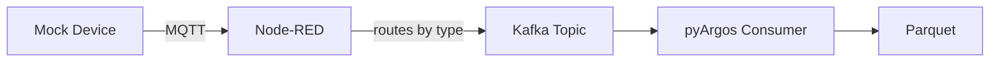
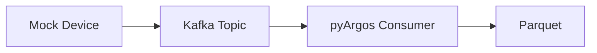

# Testing & Mock Devices

To test the system, you can send simulated data to Node-RED (via MQTT/UDP) or directly to Kafka. Transmission can be continuous at a device's frequency, or in bulk for a specific time period.

---

## Mock Device Configuration

Mock devices are specified by a JSON configuration file. The configuration can be created from an experiment downloaded from ArgosWEB or written manually.

### Configuration Format

```json
{
    "Sensor": {
        "number": 3,
        "nameprefix": "Sensor",
        "numberformat": "{:02d}",
        "frequency": 10,
        "transmission": {
            "type": "continuous",
            "bulkTimeUnit": "60s"
        },
        "fields": {
            "timestamp": "datetime",
            "temperature": "float",
            "humidity": "float",
            "status": "str",
            "count": "int"
        }
    }
}
```

### Configuration Fields

| Field | Description |
|-------|-------------|
| `number` | Number of devices to simulate |
| `nameprefix` | Prefix for device names |
| `numberformat` | Python format string for device numbering |
| `frequency` | Sampling frequency in Hz |
| `transmission.type` | `"bulk"` or `"continuous"` |
| `transmission.bulkTimeUnit` | Time duration for bulk transmissions |
| `fields` | Map of field names to data types |

### Supported Field Types

| Type | Description | Example Values |
|------|-------------|---------------|
| `datetime` | Timestamp | Current time |
| `int` | Integer | Random integer |
| `float` | Floating point | Random float |
| `str` | String | Random string |

---

## Transmission Modes

### Continuous

Sends data at the specified frequency, simulating real-time device behavior. Each device sends one message per sampling interval.

### Bulk

Sends a batch of data covering a specified time period all at once. Useful for:

- Testing data processing pipelines without waiting
- Replaying historical data
- Load testing the ingestion pipeline

---

## Test Architectures

### Via Node-RED (recommended)


<!-- mermaid source (for editing, paste into mermaid.live):

-->

This tests the full pipeline including device routing.

### Direct to Kafka


<!-- mermaid source (for editing, paste into mermaid.live):

-->

For testing without Node-RED, mock devices write directly to Kafka topics.

### Running a Demo Device

1. Install paho-mqtt:
   ```bash
   pip install paho-mqtt
   ```

2. Run the demo device from the CLI to send simulated MQTT data to your Node-RED instance.
