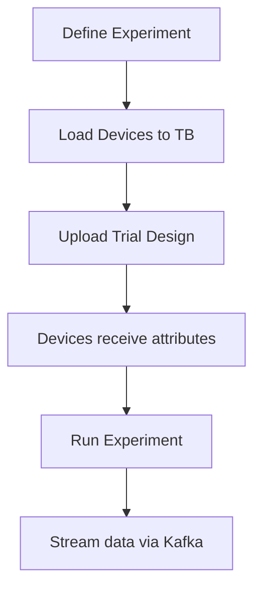

# ThingsBoard Integration

pyArgos integrates with [ThingsBoard](https://thingsboard.io/) for IoT device management, telemetry, and experiment orchestration.

---

## Configuration

Add ThingsBoard settings to `Datasources_Configurations.json`:

```json
{
    "Thingsboard": {
        "restURL": "http://localhost:8080",
        "username": "tenant@thingsboard.org",
        "password": "tenant"
    }
}
```

!!! note
    Install the ThingsBoard REST client:
    ```bash
    pip install tb_rest_client
    ```
    pyArgos will work without it but ThingsBoard features will be unavailable.

---

## Using the Experiment Manager

The `experimentManager` class provides the main interface:

```python
from argos.manager import experimentManager

manager = experimentManager("/path/to/experiment")
```

### Setup devices on ThingsBoard

```python
manager.loadDevicesToThingsboard()
```

This will:

1. Check existing device profiles on the server
2. Create missing device profiles for each entity type
3. Create devices that don't already exist (skips duplicates)

### Upload a trial design

```python
manager.loadTrialDesignToThingsboard("design", "myTrial")
```

Sets `SERVER_SCOPE` attributes on each device. Existing attributes in all scopes are cleared first.

### Get device credentials

```python
device_map = manager.getDeviceMap(deviceType="Sensor")
# {"Sensor_01": {"credential": "abc123", "type": "Sensor"}, ...}
```

### Clear all devices

```python
manager.clearDevicesFromThingsboard()
```

!!! warning
    This removes **all** tenant devices from the ThingsBoard server. Use with caution.

---

## CLI Commands

### Load trial design

```bash
python -m argos.bin.trialManager --tbLoadTrial myTrial [--directory /path/to/experiment]
```

### Setup experiment

```bash
python -m argos.bin.trialManager --tbSetupExperiment --directory /path/to/experiment
```

### Clean devices

```bash
python -m argos.bin.trialManager --tbCleanDevices [--directory /path/to/experiment]
```

---

## Attribute Scopes

ThingsBoard supports three attribute scopes:

| Scope | Description |
|-------|-------------|
| `SERVER_SCOPE` | Server-side attributes managed by pyArgos |
| `SHARED_SCOPE` | Shared between server and device |
| `CLIENT_SCOPE` | Device-side attributes |

When loading a trial, pyArgos clears all three scopes before writing new `SERVER_SCOPE` attributes to ensure a clean state.

---

## Workflow


